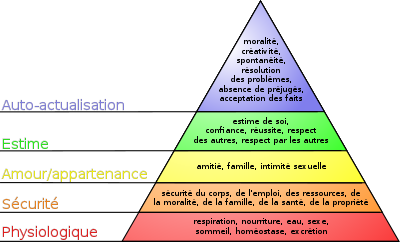
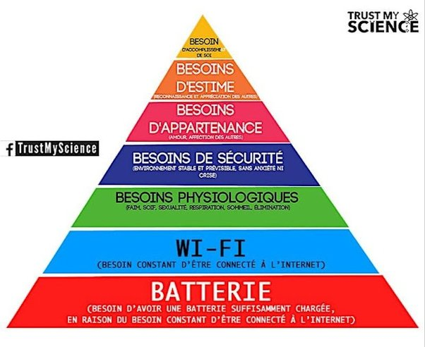

---

title: Il semble que chez le vivant les motivations principales changent par phases, ça a commencé avec la survie, actuellement chez les humains et animaux domestiques c'est la satisfaction, qu'en serait-il après ça ?
slug: il-semble-que-chez-le-vivant-les-motivations-principales-changent-par-phases-ca-a-commence-avec-la-survie-actuellement-chez-les-humains-et-animaux-domestiques-c-est-la-satisfaction-qu-en-serait-il-apres-ca
date: '2022-05-20'
draft: true
categories:
- Quora
tags: []
coverImage: ./images/qimg-c5801b0d646ab55b8b72a13a76b897c1.png
---

*Réponse publiée [sur Quora](https://fr.quora.com/Il-semble-que-chez-le-vivant-les-motivations-principales-changent-par-phases-%C3%A7a-a-commenc%C3%A9-avec-la-survie-actuellement-chez-les-humains-et-animaux-domestiques-c-est-la-satisfaction-qu-en/answer/Dr-Goulu)*

C'est très mal formulé mais je pense que vous voulez parler de la [Pyramide des besoins de Maslow](w:Pyramide_des_besoins)

Elle a été modernisée récemment

Mais dans tous les cas, au dessus des besoins de survie il y a les besoins de sécurité.
