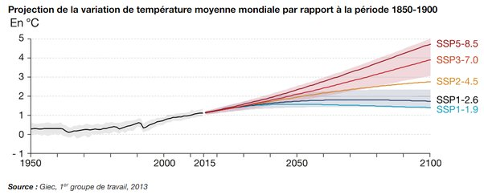

---

title: J'ai appris récemment que, même si l'on arrête complètement de produire des gaz à effets de serre, on ne pourra pas retrouver une température normale. Mais dans ce cas, à quoi bon essayer d'arrêter ?
slug: j-ai-appris-recemment-que-meme-si-l-on-arrete-completement-de-produire-des-gaz-a-effets-de-serre-on-ne-pourra-pas-retrouver-une-temperature-normale-mais-dans-ce-cas-a-quoi-bon-essayer-d-arreter
date: '2022-11-25'
draft: false
categories:
- Quora
tags: []
coverImage: ./images/qimg-0862f0ae65b7b7cf4edeea8c2ae53296.jpg
---

*Réponse publiée [sur Quora](https://fr.quora.com/Jai-appris-r%C3%A9cemment-que-m%C3%AAme-si-lon-arr%C3%AAte-compl%C3%A8tement-de-produire-des-gaz-%C3%A0-effets-de-serre-on-ne-pourra-pas-retrouver-une-temp%C3%A9rature-normale-Mais-dans-ce-cas-%C3%A0-quoi-bon-essayer/answer/Dr-Goulu)*

Vous avez mal appris.

En arrêtant de produire des gaz à effet de serre, la température redescendrait quasi immédiatement .

Avec le scénario le plus optimiste du GIEC (SSP1–1.9), la température redescendra dès 2050 environ

Avec un scénario un peu plus réaliste (SSP1–2.6), ce sera dès 2080.

Dans le meilleur des cas il faudra attendre 2200 ou 2300 pour que l'environnement absorbe le CO2 excédentaire et que la température redevienne "normale".

Si on ne fait rien, il y a un réel risque d'[Emballement climatique](w:)(SSP5–8.5) qui fera dire aux derniers humains que 2100 était une année fraîche…

Je pense de plus en plus de la réduction des émissions, on va devoir passer à la [Géoingénierie climatique](w:Géoingénierie).

[https://www.statistiques.develop...](https://www.statistiques.developpement-durable.gouv.fr/edition-numerique/chiffres-cles-du-climat-2022/3-scenarios-et-projections-climatiques)
