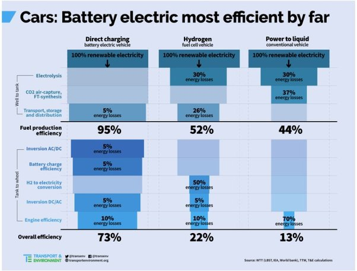

*Réponse publiée [sur Quora](https://fr.quora.com/La-technologie-des-v%C3%A9hicules-%C3%A0-hydrog%C3%A8ne-pourrait-elle-r%C3%A9gler-le-probl%C3%A8me-du-r%C3%A9chauffement-climatique/answer/Dr-Goulu)*

Non.

1. le transport n'est responsable "que" de 24.5% des émissions de CO2, et le transport routier de 74% de celles-ci, soit 18% des émissions totales[[1]](#DZJdt) . Passer tous les véhicules à l'hydrogène (ou à l'électrique) ne suffirait donc de loin pas à atteindre l'objectif de réduction des émissions de 50%
2. La [Production d'hydrogène](w:) se fait actuellement à 96% par [Reformage du méthane](w:)(49%), par [Oxydation partielle](w:)du pétrole (29%) et par [Gazéification](w:) du charbon (18%), procédés qui dégagent tous du CO2. On n'en fait que 4% par [Électrolyse de l'eau](w:). L'hydrogène est pour l'instant un exemple quasi parfait de [Greenwashing](w:)
3. L'efficacité énergétique "well to wheels" ("du puits aux roues") des véhicules électriques est 3x meilleure que ceux à hydrogène[[2]](#gdJkk) :

Ca signifie que si on voulait produire l'hydrogène de nos voitures par électrolyse, il faudrait 3x plus d'électricité propre que si on l'utilisait pour des véhicules électriques.

L'hydrogène, c'est mort…

*(edit après le*[*commentaire/remarque*](/2022/2022-09-06-la-technologie-des-vehicules-a-hydrogene-pourrait-elle-regler-le-probleme-du-rechauffement-climatique)*de*[*Philippe Fabre*](https://fr.quora.com/profile/Philippe-Fabre)*ci-dessous)*

… du moins si on a de l'électricité propre.

Parce que pour ceux qui ont du charbon, comme les USA, ça change un peu.

D'après [cette page](https://web.archive.org/web/20220927150957/https://netl.doe.gov/research/Coal/energy-systems/gasification/gasifipedia/coal-to-hydrogen-without-power-export) on atteindrait 59% de rendement énergétique charbon-H2 (en capturant le CO2 à l'usine), soit presque le double du rendement charbon->électricité (33%). C'est ce qu'on appelle le rendement "well to tank"

Ensuite, le rendement "tank to wheel" est celui qu'on trouve dans la seconde partie du graphique ci-dessus, mais il faut le calculer à partir des chiffres donnés. Il serait de 0.73/0.95 = 77% pour l'électrique contre .22/.52 soit 42% pour l'hydrogène.

Donc dans ce cas le rendement "well to wheel" pour le charbon serait de 0.59*0.42 = 25% pour l'hydrogène, ex-aeco avec .77*.33=25% pour l'électrique…

Donc je modère mon "l'hydrogène c'est mort" par "l'hydrogène c'est pour ceux qui ont du charbon et savent où stocker le CO2 capturé"

Notes de bas de page

[[1]](#cite-DZJdt)[Transport et CO2 : quelle part des émissions ?](https://www.futura-sciences.com/planete/questions-reponses/pollution-transport-co2-part-emissions-1017/)

[[2]](#cite-gdJkk)[Une nouvelle étude démontre que les VÉs sont 3 fois plus efficaces que ceux à l'hydrogène](https://www.aveq.ca/actualiteacutes/une-nouvelle-etude-demontre-que-les-ves-sont-3-fois-plus-efficaces-que-ceux-a-lhydrogene)
