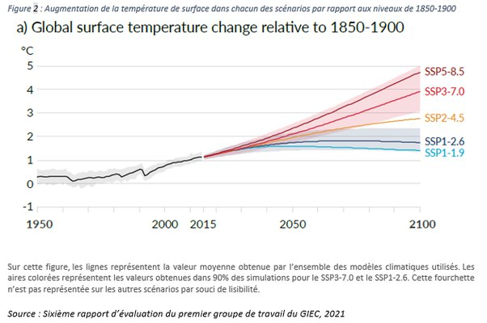

---

title: Le spécialiste du climat Jancovici dit que même si nous arrêtions toute émission de CO2, le réchauffement des 50 prochaines années est inévitable. Le journaliste Aymeric Caron dit que nous pouvons l'éviter en agissant dans les dix ans. Qui croire ?
slug: le-specialiste-du-climat-jancovici-dit-que-meme-si-nous-arretions-toute-emission-de-co2-le-rechauffement-des-50-prochaines-annees-est-inevitable-le-journaliste-aymeric-caron-dit-que-nous-pouvons-l-eviter-en-agissant-dans-les-dix-ans
date: '2022-01-31'
draft: true
categories:
- Quora
tags: []
coverImage: ./images/qimg-6c7ab2852627bc7350d26f05f080b4f7.jpg
---

*Réponse publiée [sur Quora](https://fr.quora.com/Le-sp%C3%A9cialiste-du-climat-Jancovici-dit-que-m%C3%AAme-si-nous-arr%C3%AAtions-toute-%C3%A9mission-de-CO2-le-r%C3%A9chauffement-des-50-prochaines-ann%C3%A9es-est-in%C3%A9vitable-Le-journaliste-Aymeric-Caron-dit-que/answer/Dr-Goulu)*

[Jean-Marc Jancovici](w:)est un ingénieur spécialiste de l'énergie, mais pas du climat.

Vous ne devez croire personne. Vous devez vous informer pour savoir.

Le réchauffement est inévitable sur les 50 prochaines années. La seule question qui subsiste est de savoir si on arrivera à le stabiliser ce siècle entre +2 et +3°, ou si ça part en vrille.

