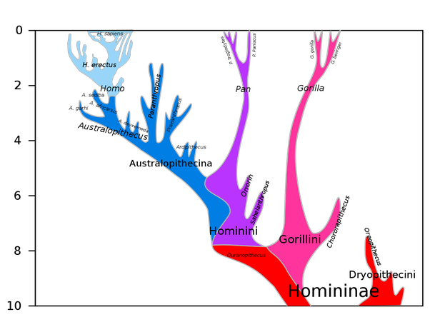

*Réponse publiée [sur Quora](https://fr.quora.com/Les-premiers-hommes-sur-la-Terre-sont-de-quelle-race/answer/Dr-Goulu)*

il n'y a pas de race, et [il n'y a pas eu de premiers hommes sur la Terre](https://www.youtube.com/watch?v=xdWLhXi24Mo)

[https://www.youtube.com/watch?v=...](https://www.youtube.com/watch?v=xdWLhXi24Mo)

Quand on remonte notre arbre généalogique, on distingue des espèces car il y a eu des branches de la famille qui ont abouti à d'autres espèces, dont beaucoup ont disparu.

On considère actuellement que l'ancêtre le plus lointain des Homo Sapiens qui ne soit pas en même temps un ancêtre de nos cousins chimpanzés et bonobos est

[Toumaï](w:Toumaï)

de l'espèce [Sahelanthropus tchadensis](w:), ancêtre probable ou du moins possible des diverses espèces d'[Australopithèques](w:Australopithèque), dont une est l'ancêtre des diverses espèces d'[Homo](w:), dont nous sommes la seule branche survivante.

L'arbre généalogique de la famille ( source : [Histoire évolutive de la lignée humaine](w:))
