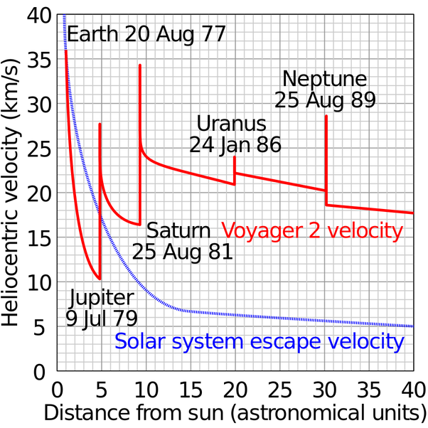

*Réponse publiée [sur Quora](https://fr.quora.com/Pensez-vous-que-dans-le-film-interstellar-la-trajectoire-utilis%C3%A9e-pour-envoyer-l-endurance-vers-Saturne-depuis-la-Terre-grace-a-une-fronde-gravitationnelle-de-Mars-est-r%C3%A9aliste-8-mois-pour/answer/Dr-Goulu)*

Mars est beaucoup trop peu massive pour servir de "fronde gravitationnelle" efficace. Impossible de tripler la vitesse[[1]](#PTmta)d'un vaisseau avec Mars, c'est tout juste possible avec Jupiter comme on le voit sur ce relevé de Voyager 2 :

A ma connaissance, les seules sondes qui ont utilisé l'[Assistance gravitationnelle](w:) de Mars sont [Rosetta](w:Rosetta_(sonde_spatiale)), qui est passée à 250 km de la surface seulement, et [Juno](w:Juno_(sonde_spatiale)). Dans les deux cas, Mars n'a servi qu'à ajuster un peu le cap et prendre des images au passage, pas à accélérer vers le système solaire externe.

Pour aller vers Saturne, la sonde [Cassini-Huygens](w:)a utilisé deux fois l'assistance de Vénus, puis celle de Jupiter. Et comme [indiqué ici](w:Assistance_gravitationnelle), l'objectif n'était même pas d'y aller plus vite, mais d'y aller tout court :

> La sonde [*Cassini-Huygens*](w:Cassini-Huygens_(sonde_spatiale)) a utilisé à plusieurs reprises l'assistance gravitationnelle pour parvenir à [Saturne](w:Saturne_(planète)). Elle a modifié son vecteur vitesse d'abord en passant à deux reprises près de [Vénus](w:Vénus_(planète)) puis la [Terre](w:Terre_(planète)) et enfin [Jupiter](w:Jupiter_(planète)). L'utilisation de l'assistance gravitationnelle a allongé sa trajectoire qui a duré 6,7 ans au lieu des 6 ans nécessaires pour une [orbite de transfert](w:) de Hohman mais elle a permis d'économiser un [delta-V](w:) de 2 km/s permettant à cette sonde particulièrement lourde d'atteindre Saturne. Il aurait fallu donner une vitesse de 15,6 km/s à la sonde (en négligeant la gravité de Saturne et de la Terre ainsi que les effets de la trainée atmosphérique) pour la placer sur une trajectoire directe ce qu'aucun [lanceur](w:Lanceur_(astronautique)) à l'époque n'aurait été capable de faire.

Interstellar est hélas plein d'incohérences très regrettables, ça en fait une de plus.

[https://www.drgoulu.com/2014/11/...](/2014/11/29/interstellar/)

Notes de bas de page

[[1]](#cite-PTmta)[Endurance](https://web.archive.org/web/20220120144603/https://interstellarfilm.fandom.com/wiki/Endurance)
