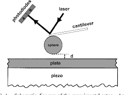

*Réponse publiée [sur Quora](https://fr.quora.com/Peut-on-voir-leffet-Casimir-sur-une-vid%C3%A9o-Voit-on-les-miroirs-se-rapprocher-en-direct/answer/Dr-Goulu)*

Non, les verifications experimentales de l'

[Effet Casimir](w:Effet_Casimir)

ne permettent pas de voir l'effet à l'œil nu. La distance entre les "plaques" doit être inferieure a la longueur d'onde de la lumière

Dans cet article

[https://arxiv.org/abs/physics/98...](https://arxiv.org/abs/physics/9805038)

Les auteurs ont utilisé un microscope à force atomique avec ce schéma :

Avec le piezo inférieur ils ont rapproché la plate de la sphère jusqu'à ce que la force de Casimir fasse fléchir le cantilever, ce qui fait varier l'angle de réflexion du laser, mesuré par une différence au niveau des photodiodes.
