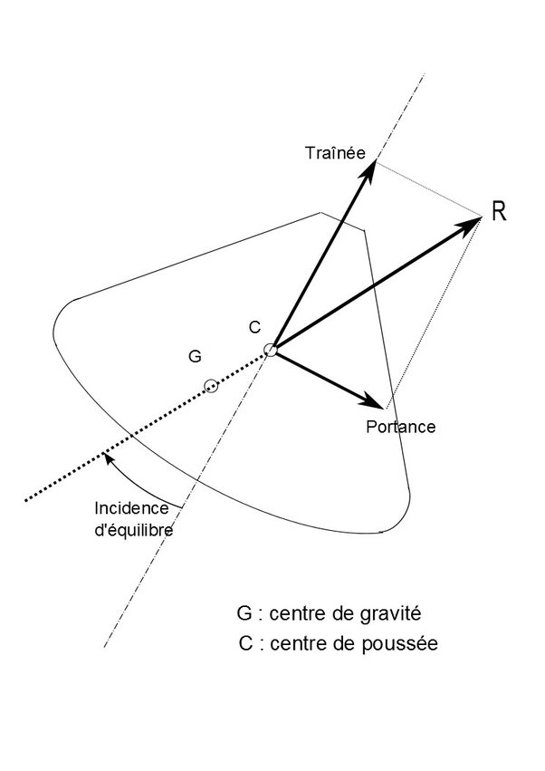

*Réponse publiée [sur Quora](https://fr.quora.com/Pourquoi-les-lois-a%C3%A9rodynamiques-nont-elles-pas-fait-en-sorte-que-la-rentr%C3%A9e-de-la-capsule-Apollo-soit-un-virage-%C3%A0-180/answer/Dr-Goulu)*

L'aérodynamique fait ce qu'elle veut, mais les ingénieurs de la NASA ont été plus malins : ils ont calculé la forme de la capsule pour qu'elle descende dans la position où le bouclier thermique éviterait aux astronomes de se faire rôtir.

Vous trouverez des infos intéressantes dans

[Rentrée atmosphérique](w:Rentrée_atmosphérique)

Notamment au chapitre "La trajectoire d'un objet portant" où se trouve cette figure :

Qui montre que la capsule a un centre de gravité plus bas que le centre de poussée (comme les bateaux…) et, ce que je ne savais pas, décentré pour pouvoir légèrement diriger la capsule en la faisant tourner autour de son axe pour orienter une légère portance.
