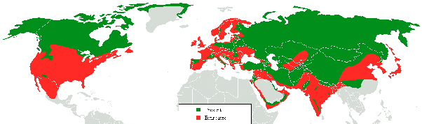

*Réponse publiée [sur Quora](https://fr.quora.com/Pourquoi-les-loups-errants-ne-pouvaient-ils-pas-se-croiser-avec-les-loups-gris-%C3%89tait-ce-la-raison-de-leur-disparition/answer/Dr-Goulu)*

Qu'appelez-vous "loups errants" ? Les 24 sous-espèces de [Canis lupus](w:)sont:

- [*Canis lupus lupus*](w:Canis_lupus_lupus) (le loup gris)
- [*Canis lupus familiaris*](w:Canis_lupus_familiaris) (notre ami le chien)
- [*Canis lupus albus*](w:Canis_lupus_albus) (loup de Sibérie)
- [*Canis lupus arabs*](w:Canis_lupus_arabs) (loup d'Arabie)
- [*Canis lupus arctos*](w:Canis_lupus_arctos) (loup arctique)
- [*Canis lupus baileyi*](w:Canis_lupus_baileyi) (loup du Mexique)
- [*Canis lupus campestris*](w:Canis_lupus_campestris) (loup des steppes)
- [*Canis lupus chanco*](w:Canis_lupus_chanco) (loup mongol)
- [*Canis lupus dingo*](w:Canis_lupus_dingo) (le dingo)
- [*Canis lupus labradorius*](w:Canis_lupus_labradorius) (un loup du Labrador comme son nom l'indique)
- [*Canis lupus hudsonicus*](w:Canis_lupus_hudsonicus) (un autre loup du Labrador)
- [*Canis lupus crassodon*](w:Canis_lupus_crassodon) (encore un loup du Labrador)
- [*Canis lupus irremotus*](w:Canis_lupus_irremotus) (encore un autre loup du Labrador)
- [*Canis lupus mackenzii*](w:Canis_lupus_mackenzii) (un loup du Labrador, encore)
- [*Canis lupus ligoni*](w:Canis_lupus_ligoni) (un avant dernier loup du Labrador)
- [*Canis lupus nubilus*](w:Canis_lupus_nubilus) (un dernier loup du Labrador pour la route)
- [*Canis lupus lycaon*](w:Canis_lupus_lycaon) (loup de l'Est)
- [*Canis lupus manningi*](w:Canis_lupus_manningi) (loup du Canada)
- [*Canis lupus occidentalis*](w:Canis_lupus_occidentalis) (un autre loup du Canada)
- [*Canis lupus pambasileus*](w:Canis_lupus_pambasileus) (encore un loup du Canada)
- [*Canis lupus tundrarum*](w:Canis_lupus_tundrarum) (et re-loup du Canada)
- [*Canis lupus orion*](w:Canis_lupus_orion) (loup du Groenland)
- [*Canis lupus pallipes*](w:Canis_lupus_pallipes) (loup des Indes)
- [*Canis lupus rufus*](w:Canis_lupus_rufus) (loup rouge)

et 13 sous-espèces disparues:

- [†](w:Extinction_des_espèces)*Canis lupus alces*
- [†](w:Extinction_des_espèces)*Canis lupus beothucus*
- [†](w:Extinction_des_espèces)*Canis lupus bernardi*
- [†](w:Extinction_des_espèces)*Canis lupus columbianus*
- [†](w:Extinction_des_espèces)*Canis lupus floridanus*
- [†](w:Extinction_des_espèces)*Canis lupus fuscus*
- [†](w:Extinction_des_espèces)*Canis lupus gregoryi*
- [†](w:Extinction_des_espèces)*Canis lupus griseoalbus*
- [†](w:Extinction_des_espèces)*Canis lupus hattai*
- [†](w:Extinction_des_espèces)*Canis lupus hodophilax*
- [†](w:Extinction_des_espèces)*Canis lupus mogollonensis*
- [†](w:Extinction_des_espèces)*Canis lupus monstrabilis*
- [†](w:Extinction_des_espèces)*Canis lupus youngi*

toutes ces sous-espèces sont (ou étaient) interfécondes, donc la cause de leur disparition doit être recherchée ailleurs. Peut-être qu'un coup d'œil à la carte du monde où les zones en rouge sont celles où les loups sauvages ont disparu vous donnera un indice:

En fait nous avons introduit 900 millions de chiens [[1]](#CUYFy) dans ces zones, alors que les zones vertes n'abritent plus que 200 à 250 millions de loups sauvages …

Notes de bas de page

[[1]](#cite-CUYFy)[How Many Dogs Are There In The World?](https://www.worldatlas.com/articles/how-many-dogs-are-there-in-the-world.html)

---

*Réponse publiée [sur Quora](https://fr.quora.com/Pourquoi-les-loups-errants-ne-pouvaient-ils-pas-se-croiser-avec-les-loups-gris-%C3%89tait-ce-la-raison-de-leur-disparition/answer/Dr-Goulu)*

Qu'appelez-vous "loups errants" ? Les 24 sous-espèces de [Canis lupus](w:)sont:

- [*Canis lupus lupus*](w:Canis_lupus_lupus) (le loup gris)
- [*Canis lupus familiaris*](w:Canis_lupus_familiaris) (notre ami le chien)
- [*Canis lupus albus*](w:Canis_lupus_albus) (loup de Sibérie)
- [*Canis lupus arabs*](w:Canis_lupus_arabs) (loup d'Arabie)
- [*Canis lupus arctos*](w:Canis_lupus_arctos) (loup arctique)
- [*Canis lupus baileyi*](w:Canis_lupus_baileyi) (loup du Mexique)
- [*Canis lupus campestris*](w:Canis_lupus_campestris) (loup des steppes)
- [*Canis lupus chanco*](w:Canis_lupus_chanco) (loup mongol)
- [*Canis lupus dingo*](w:Canis_lupus_dingo) (le dingo)
- [*Canis lupus labradorius*](w:Canis_lupus_labradorius) (un loup du Labrador comme son nom l'indique)
- [*Canis lupus hudsonicus*](w:Canis_lupus_hudsonicus) (un autre loup du Labrador)
- [*Canis lupus crassodon*](w:Canis_lupus_crassodon) (encore un loup du Labrador)
- [*Canis lupus irremotus*](w:Canis_lupus_irremotus) (encore un autre loup du Labrador)
- (un loup du Labrador, encore)
- [*Canis lupus ligoni*](w:Canis_lupus_ligoni) (un avant dernier loup du Labrador)
- [*Canis lupus nubilus*](w:Canis_lupus_nubilus) (un dernier loup du Labrador pour la route)
- [*Canis lupus lycaon*](w:Canis_lupus_lycaon) (loup de l'Est)
- [*Canis lupus manningi*](w:Canis_lupus_manningi)
- [*Canis lupus occidentalis*](w:Canis_lupus_occidentalis) (loup du Canada, qui regroupe les sous espèces suivantes:
- [*Canis lupus orion*](w:Canis_lupus_orion) (loup du Groenland)
- [*Canis lupus pallipes*](w:Canis_lupus_pallipes) (loup des Indes)
- [*Canis lupus rufus*](w:Canis_lupus_rufus) (loup rouge)

et 13 sous-espèces disparues:

- [†](w:Extinction_des_espèces)*Canis lupus alces ( loup de la*[*péninsule Kenai*](w:Péninsule_Kenai)
- [†](w:Extinction_des_espèces)*Canis lupus beothucus*
- [†](w:Extinction_des_espèces)*Canis lupus bernardi*
- [†](w:Extinction_des_espèces)*Canis lupus columbianus*
- [†](w:Extinction_des_espèces)*Canis lupus floridanus*
- [†](w:Extinction_des_espèces)*Canis lupus fuscus*
- [†](w:Extinction_des_espèces)*Canis lupus gregoryi*
- [†](w:Extinction_des_espèces)*Canis lupus griseoalbus*
- [†](w:Extinction_des_espèces)*Canis lupus hattai*
- [†](w:Extinction_des_espèces)*Canis lupus hodophilax*
- [†](w:Extinction_des_espèces)*Canis lupus mogollonensis*
- [†](w:Extinction_des_espèces)*Canis lupus monstrabilis*
- [†](w:Extinction_des_espèces)*Canis lupus youngi*

toutes ces sous-espèces sont (ou étaient) interfécondes, donc la cause de leur disparition doit être recherchée ailleurs. Peut-être qu'un coup d'œil à la carte du monde où les zones en rouge sont celles où les loups sauvages ont disparu vous donnera un indice:

En fait nous avons introduit 900 millions de chiens [[1]](#drgRs) dans ces zones, alors que les zones vertes n'abritent plus que 200 à 250 millions de loups sauvages …

Notes de bas de page

[[1]](#cite-drgRs)[How Many Dogs Are There In The World?](https://www.worldatlas.com/articles/how-many-dogs-are-there-in-the-world.html)
