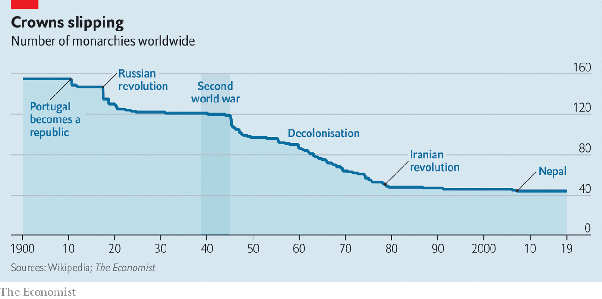

*Réponse publiée [sur Quora](https://fr.quora.com/Pourquoi-les-monarchies-du-monde-entier-se-sont-elles-d%C3%A9velopp%C3%A9es-et-l-Inde-a-t-elle-appris-que-la-d%C3%A9mocratie-n-est-certainement-pas-garantie-pour-le-d%C3%A9veloppement-%C3%A9conomique-et-que-la/answer/Dr-Goulu)*

C'est vrai ça ?

Vous avez 3 affirmations dans votre "question" :

1. les monarchies du monde entier se sont développées
2. l'Inde a appris que la démocratie n'est certainement pas garantie pour le développement économique
3. la justice sociale est abandonnée pour le nationalisme hindou

reliées par la conjonction ET, donc le tout n'est vrai que si les 3 propositions le sont.

Alors vérifions.

Voici le nombre de monarchies dans le monde depuis 1900[[1]](#bAkAg)

Il a baissé d'environ 150 à 44 actuellement.

Donc les monarchies du monde ne se sont pas développées, votre proposition est fausse et il n'y a donc pas de réponse à votre "pourquoi…?"

Pour le 2, je vous laisse me trouver la preuve que "l'Inde a appris…" une autre chose fort discutable quand on voit que de nombreuses démocraties ont des [Croissance du PIB](https://donnees.banquemondiale.org/indicator/NY.GDP.MKTP.KD.ZG)très élevées, notamment l'Inde avec 8.9%, au dessus de la Chine (8.1%)

Et pour le 3, c'est malheureux, mais c'est le résultat de choix politiques faits par les électeurs. Dans une démocratie, vous pouvez changer ça aux prochaines élections.

Essayez de ne poser qu'une question claire à la fois svp.

Notes de bas de page

[[1]](#cite-bAkAg)[How monarchies survive modernity](https://web.archive.org/web/20221204114402/https://www.economist.com/international/2019/04/27/how-monarchies-survive-modernity)
