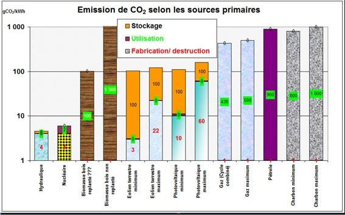

*Réponse publiée [sur Quora](https://fr.quora.com/Qu-est-ce-qui-prouve-que-l-%C3%A9nergie-nucl%C3%A9aire-est-verte/answer/Dr-Goulu)*

Elle n'est pas verte mais très faiblement carbonée.

Il y a des débats sans fin pour savoir si c'est un peu plus ou un peu moins que le solaire ou l'éolien, mais c'est clairement 100x mieux que le charbon ou le pétrole, tout simplement parce quelques grammes d'uranium dégagent autant d'énergie qu'un train de charbon.

Une explication qui me semble cohérente est que le nucléaire est disponible à la demande alors que l'éolien et photovoltaïque sont intermittents et nécessitent des moyens de stockage coûteux (en argent et en CO2).

([Source](https://web.archive.org/web/20221127063229/https://cil-gerland-guillotiere.fr/pourquoi-utiliser-lelectricite-pour-sauver-le-climat/) attention à l'échelle verticale logarithmique)
