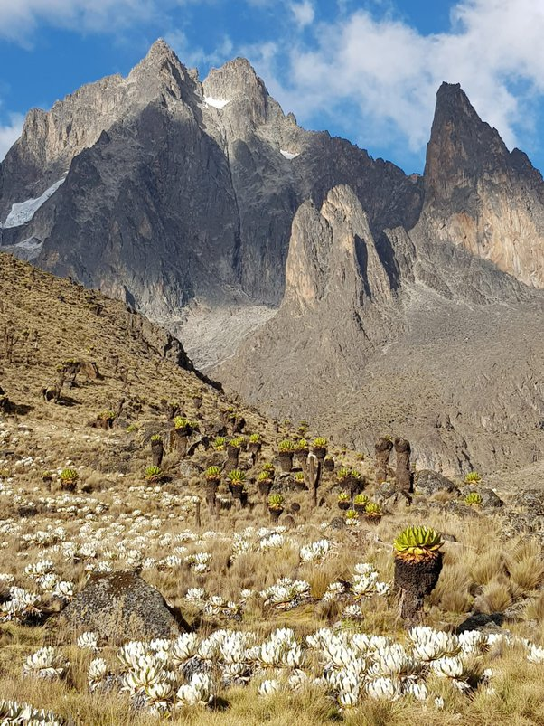
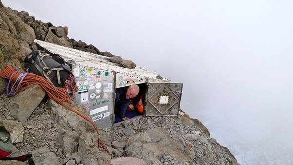

*Réponse publiée [sur Quora](https://fr.quora.com/Quel-est-le-lieu-sur-terre-o%C3%B9-il-neige-au-niveau-de-la-mer-le-plus-proche-de-l-%C3%A9quateur/answer/Dr-Goulu)*

(mea culpa, j'ai zappé "niveau de la mer" dans cette réponse…)

[Mont Kenya](w:), 0° 09′ 22″ sud, 5199m.

photo faite par un copain qui l'a gravi :

la "cabane" qui est en haut :

Mon copain y a trouvé une paire de skis !

article intéressant :

[Étage nival](w:Étage_nival)
