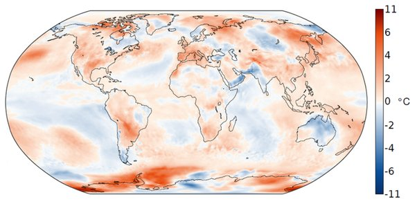

---

title: Quel rapport /Les tempêtes solaires (26 juin, 18 19 juillet, 17, 18 et 19 août) et les canicules de cet été, sur fond d'affaiblissement (dimin. 9% en 50 ans) de la magnétosphère . Y aura-il vraiment un pic d’activité solaire, entre 2023 et 2026?
slug: quel-rapport-les-tempetes-solaires-26-juin-18-19-juillet-17-18-et-19-aout-et-les-canicules-de-cet-ete-sur-fond-d-affaiblissement-dimin-9-en-50-ans-de-la-magnetosphere-y-aura-il-vraiment-un-pic-dactivite-solaire-entre-2023-et-2026
date: '2022-09-05'
draft: false
categories:
- Quora
tags: []
coverImage: ./images/qimg-013c8313ea458a730aa47600f3fcc708.jpg
---

*Réponse publiée [sur Quora](https://fr.quora.com/Quel-rapport-Les-temp%C3%AAtes-solaires-26-juin-18-19-juillet-17-18-et-19-ao%C3%BBt-et-les-canicules-de-cet-%C3%A9t%C3%A9-sur-fond-d-affaiblissement-dimin-9-en-50-ans-de-la-magn%C3%A9tosph%C3%A8re-Y-aura-il/answer/Dr-Goulu)*

Aucun rapport (jusqu'à preuve du contraire, comme toujours en science)

Le [Cycle solaire](w:)a une période approximative de 11 ans et se traduit surtout par un nombre plus ou moins grand de taches solaires. La variation correspondant de luminosité (dans tout le spectre) est de 0.1% environ.

C'est totalement négligeable et décorrélé dans le temps par rapport à l'ampleur du réchauffement climatique et des extrêmes météorologiques (canicules, sécheresses, cyclones etc) qui sont parfaitement corrélées avec le taux de gaz à effets de serre de l'atmosphère qui augmente depuis 150 ans.

Et en passant, nous avons eu des canicules en été en Europe, mais en Asie ils ont eu des moussons record en Asie avec des records de froid en Australie du Nord…

Distribution mondiale de la température en [Juillet 2022](https://web.archive.org/web/20220811070558/https://www.meteosuisse.admin.ch/home/actualite/meteosuisse-blog.subpage.html/fr/data/blogs/2022/8/juillet-2022-au-niveau-mondial.html). L’écart (en °C) à la norme 1991-2020 est représenté (basé sur les données ERA5). Source : Copernicus
