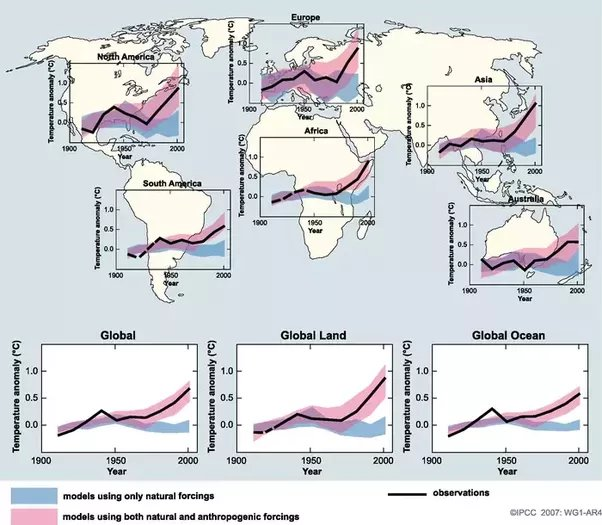

*Réponse publiée [sur Quora](https://fr.quora.com/Quelle-justification-%C3%A9tay%C3%A9e-et-r%C3%A9f%C3%A9renc%C3%A9e-les-climatologues-donnent-ils-pour-%C3%A9carter-la-chaleur-provenant-des-activit%C3%A9s-humaines-de-leur-r%C3%A9flexion-sur-les-causes-du-r%C3%A9chauffement/answer/Dr-Goulu)*

outre la réponse détaillée de [Iznotsobad](https://fr.quora.com/profile/Iznotsobad) sur le dégagement de chaleur, la responsabilité des dégagements anthropiques de gaz à effets de serre dans le réchauffement est démontrée par de nombreuses études depuis au moins 2007

Sur la page

[https://archive.ipcc.ch/publicat...](https://web.archive.org/web/20211015211220/https://archive.ipcc.ch/publications_and_data/ar4/wg1/fr/spmsspm-5.html)

qui date de 2007, vous trouverez cette illustration qui synthétise les résultats de

> *19 simulations de cinq modèles climatiques qui n’utilisaient que les forçages naturels dus à l’activité solaire et aux volcansen bleu. Les bandes rouges ombrées représentent l’intervalle de 5–95% pour 58 simulations provenant de 14 modèles climatiques utilisant des forçages à la fois naturels et anthropiques.*

On voit qu'on pouvait encore suspecter une cause uniquement naturelle jusque dans les années 1970 voire 2000 pour certaines régions, ce qui justifiait une certaine prudence encore en 2007, mais ce n'est absolument plus le cas maintenant.

Le rapport [https://www.ipcc.ch/site/assets/...](https://www.ipcc.ch/site/assets/uploads/2018/02/ar4-wg1-chapter9-1.pdf) cite environ 500 articles revus par les pairs publiés par des scientifiques de presque tous les pays du monde qui décrivent les modèles utilisés, les hypothèses faites, les validation par des mesures, les estimations des marges d'erreur etc etc etc.

Vous avez donc le choix parmi ces 500 articles, et probablement beaucoup d'autres parus depuis 2007

Pour vous montrer comment y accéder, j'en ai pris un au hasard parce qu'il y a le mot "validation" dans le titre (et la validation de modèles dynamiques était une de mes spécialités)

Yokohata, T., et al., 2005: Climate response to volcanic forcing: Validation of climate sensitivity of a coupled atmosphere-ocean general circulation model. Geophys. Res. Lett., 32, L21710, doi:10.1029/2005GL023542.

Vous allez sur Google Scholar est vous cherchez le titre :

[https://scholar.google.com/schol...](https://scholar.google.com/scholar?hl=fr&as_sdt=0,5&q=Climate+response+to+volcanic+forcing:+Validation+of+climate+sensitivity+of+a+coupled+atmosphere-ocean+general+circulation+model&btnG=)

vous cliquez sur "Full View" et vous arrivez là dessus :

[https://agupubs.onlinelibrary.wi...](https://web.archive.org/web/20210525180014/https://agupubs.onlinelibrary.wiley.com/doi/full/10.1029/2005GL023542)

Si j'ai bien compris en 2 minutes, les auteurs japonais comparent les résultats de modèles climatiques en tenant compte ou pas d'une éruption volcanique (Pinatubo) pour évaluer leur sensibilité aux événements volcaniques et proposent une approche pour améliorer la sensibilité des modèles à ceci.

Voilà, vous en demandiez une, le GIEC et moi vous en fournissons 500 sur un plateau.

[Robert Surcouf](https://fr.quora.com/profile/Robert-Surcouf-2) vous déverse un flot d'âneries climatosceptiques de niveau zéro, et pas une seule référence. Pas parce qu'il est à côté de la plaque mais parce qu'il n'en a aucune pour étayer ses bêtises.

A vous de choisir …
