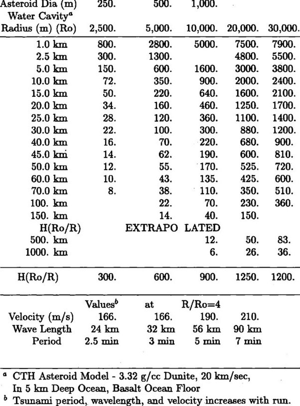

*Réponse publiée [sur Quora](https://fr.quora.com/Quelles-seraient-les-cons%C3%A9quences-si-un-asteroide-de-1000-m-de-diam%C3%A8tre-tombait-au-milieu-du-Pacifique/answer/Dr-Goulu)*

Un très gros plouf.

D'après cette table trouvée dans cet article[[1]](#LAHTM) , un astéroïde de 1000m ferait un trou dans l'eau de 10'000 m de rayon qui produirait des vagues d'une hauteur donnée dans la 4ème colonne. Ca ferait des vagues de tsunami de 6m toutes les 5 minutes à 1000km …

Notes de bas de page

[[1]](#cite-LAHTM)[https://lib-www.lanl.gov/tsunami...](https://web.archive.org/web/20220120/https://lib-www.lanl.gov/tsunami/00394718.pdf#page=21)
