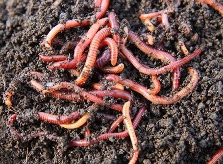

*Réponse publiée [sur Quora](https://fr.quora.com/Sommes-nous-la-seule-esp%C3%A8ce-mammif%C3%A8re-%C3%A0-avoir-du-plaisir-%C3%A0-se-reproduire-Si-nous-n-avions-pas-cette-tare-nous-n-aurions-plus-de-violeurs-plus-prostitu%C3%A9es-plus-de-p%C3%A9dophile-etc-et-j-arr/answer/Dr-Goulu)*

La [Réponse de Soul Nikiema](https://fr.quora.com/Sommes-nous-la-seule-esp%C3%A8ce-mammif%C3%A8re-%C3%A0-avoir-du-plaisir-%C3%A0-se-reproduire-Si-nous-navions-pas-cette-tare-nous-naurions-plus-de-violeurs-plus-prostitu%C3%A9es-plus-de-p%C3%A9dophile-etc-et/answer/Soul-Nikiema-1)souligne un point important : nous n'avons pas de plaisir à nous reproduire mais à nous accoupler !

Ce sont les actes sexuels qui donnent du plaisir, pas le fait d'avoir des petits (demandez à une femme en plein accouchement…). La mère d'un copain avait dit à ses 20 ans : "le moment où j'ai eu le plus de plaisir avec lui, c'est 9 mois avant sa naissance…"

Certaines peuplades isolées ne faisaient pas le lien entre acte sexuel et naissance des enfants encore au début du 20ème siècle.[[1]](#kEEya)Les autres animaux ne le font clairement pas, la période de gestation excédant largement leur horizon de prévision du futur.

D'un point de vue évolutionniste, la question devient : pourquoi TOUS les animaux (dont nous sommes) investissent une énergie énorme en parades de séduction, construction de nids ou de terriers, voyages à travers un monde plein de dangers et de prédateurs, affrontements violents avec des congénères etc ?

Pour se reproduire ? Bof… Après faut s'occuper des gamins pendant des mois, voire des années …

C'EST POUR LE SEXE !!!

Du ver de terre à la baleine bleue, ils sont tous accros au sexe, parce que c'est le pied géant !

( Si c'est pas une belle partouze, ça ! Et chaque ver est hermaphrodite, à la fois mâle et femelle, alors je vous laisse imaginer … Et avec le mot "sexe" dans l'article et tout ce rose, je parie que la photo sera floutée sur Quora … )

Si il y avait mieux que le sexe comme plaisir, on disparaîtrait vite fait !

En fait nous sommes peut-être bien la seule espèce à avoir inventé des drogues capables de rivaliser avec le plaisir sexuel. Je dis "peut-être" parce que je n'ai jamais essayé, de peur que ce soit vrai …

Pour revenir à la question, il y a quand même une différence majeure entre les "tares" que vous citez : entre adultes consentants tout est permis ou devrait l'être..

Les autres cas sont pénalement et moralement interdits justement parce qu'ils privent la victime d'avoir une vie sexuelle épanouie par la suite, ce qui est extrêmement grave, et triste.

Notes de bas de page

[[1]](#cite-kEEya)[Comment les humains ont-ils fini par faire le lien entre le sexe et les bébés?](https://web.archive.org/web/20230131142917/https://www.slate.fr/story/67281/comment-humains-rapport-sexe-bebe)
