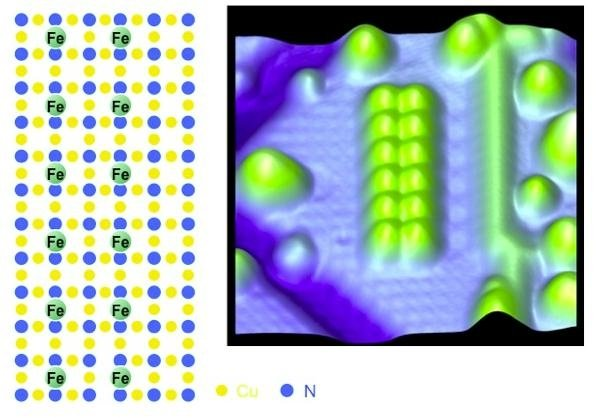

*Réponse publiée [sur Quora](https://fr.quora.com/Pensez-vous-qu-on-peut-miniaturiser-notre-technologie-encore-plus-qu-actuellement-aujourd-hui-des-cartes-micro-SD-font-1TB-par-exemple-mais-quid-dans-15-ans/answer/Dr-Goulu)*

Oui, on peut augmenter jusqu'au nombre d'Avogadro : 6^23 bits par mole de matière, soit des millions de fois plus qu'aujourd'hui.

Ce qui nous limite aujourd'hui c'est la technologie de gravure qui ne nous permet d'utiliser que la surface de la matière, et le fait qu'il faut utiliser une partie "passive" de la matière pour alimenter et refroidir la partie "active", et aussi qu'il faut plus d'un atome ou molécule par bit.

On sait déjà contourner tous ces obstacles avec la manipulation d'atomes individuels par des microscopes à force atomique:

(12 bits à 1 atome de fer par bit, déjà 100x plus dense que les meilleures mémoires actuelles, IBM[[1]](#bVXtc) )

C'est juste très lent.

Mais pourquoi avez-vous besoin d'une énorme mémoire rapide ? L'informatique utilise en fait une [Hiérarchie de mémoire](w:): seule la mémoire proche du processeur doit être rapide, et ensuite il faut une hiérarchie de mémoires cache qui puisse fournir rapidement l'information que vous allez probablement désirer juste après, jusqu'à internet.

Si vous voulez avoir tout internet sur votre clé USB ou microSD, il faudra trouver un moyen de maintenir tout son contenu à jour avec un réseau supportant des terabytes/seconde alors que vous n'allez en avoir besoin que d'une minuscule fraction…

Si vous pensez à la puissance de calcul, alors le cerveau humain est capable d'environ 1 exaFLOPS pour 1.5 kg et 20 watts de consommation.

[https://www.drgoulu.com/2013/03/...](/2013/03/11/combien-de-processeurs-pour-un-cerveau/#.Y7K5cnbMKCo)

Là on a pas mal de boulot, mais encore une fois : pourquoi faire ? On peut obtenir des exaFLOPS dans des super ordinateurs et transmettre les infos par réseau ou radio aux petits robots qui pourraient en avoir besoin …

Bref, dans 15 ans on en sera exactement là où vous (= le marché) voudra. Combien serez vous prêt à payer pour avoir quelle information dans quel délai ? Ou autrement dit, que regrettez vous dans les systèmes d'information actuels ? vous manquez de mémoire ? de puissance de calcul ? ou de bande passante ? ou vous trouvez tout ça trop cher ?

Techniquement,

[https://www.drgoulu.com/2009/06/...](/2009/06/11/il-y-a-plein-de-place-en-bas-2/#.Y7K71XbMKCo)

Notes de bas de page

[[1]](#cite-bVXtc)[IBM stores binary data on just 12 atoms - ExtremeTech](https://www.extremetech.com/computing/113237-ibm-stores-binary-data-on-12-atoms)
