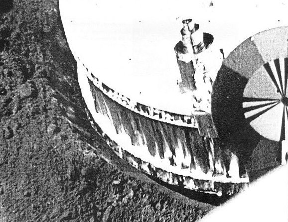

*Réponse publiée [sur Quora](https://fr.quora.com/Qu-est-ce-que-l-on-connaissait-ou-plut%C3%B4t-ne-connaissait-pas-de-la-Lune-avant-le-fameux-discours-de-F-Kenedy-qui-lan%C3%A7a-la-course-%C3%A0-la-Lune-Est-ce-que-l-on-connaissait-par-exemple-sa-taille/answer/Dr-Goulu)*

On avait évidemment depuis longtemps une très bonne connaissance de la Lune, en particulier de la [Distance lunaire](w:) qui découle directement de sa période de révolution par la 3ème loi de Kepler. Avec les radar (1959) et les lasers (1962) on a atteint une précision largement inférieure au mètre. La taille de la Lune s'obtient alors directement par une mesure d'angle.

Kennedy (avec deux N , et son prénom était John Fitzgerald, donc pas F.) a fait son discours le 12 septembre 1962 , en plein pendant le [Programme Luna](w:)des russes, et trois ans après le succès de [Luna 2](w:)qui fut le premier objet humain à toucher la surface de la Lune, le 14 septembre 1959.

Ensuite les russes ont posé [Luna 9](w:) en douceur sur la Lune le 3 février 1966 , les américains y ont posé [Surveyor 1](w:)le 2 juin 1966, qui a notamment pris cette photo de son pied enfoncé dans le sol lunaire, et après quelques autres sondes on en connaissait largement assez pour poser des humains 3 ans plus tard.

