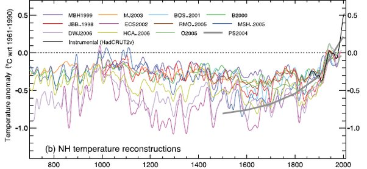

*Réponse publiée [sur Quora](https://fr.quora.com/Pourquoi-les-climato-septiques-utilisent-ils-l-optimum-climatique-m%C3%A9di%C3%A9val-comme-argument-pour-justifier-que-le-r%C3%A9chauffement-climatique-n-est-pas-d-origine-entropique-Quelles-sont-les/answer/Dr-Goulu)*

"anthropique : du à la présence d'êtres humains", pas "entropique : relatif à l'entropie, notion thermodynamique"

Réponse à la question 1 : parce que ça les arrange et qu'ils n'y connaissent rien.

Réponse à la question 2 si "réchauffement" se rapporte à [Optimum climatique médiéval](w:):

> Les recherches initiales sur cet événement climatique et le petit âge glaciaire qui s'ensuivit ont essentiellement été menées en Europe où le phénomène semble être la fois le plus visible et surtout le mieux documenté.
>
>
>
> Il était admis initialement que les variations de température étaient mondiales. Cependant, ces vues sont remises en question ; le rapport 2001 du [Groupe d'experts intergouvernemental sur l'évolution du climat](w:) résume l’état des connaissances, selon le panel d'experts et de sciences représentés au sein de cet organisme : « …les faits actuels ne permettent pas d’affirmer qu’il y ait eu des périodes synchrones de refroidissement ou de réchauffement anormal sur la période considérée, et les termes conventionnels de « petit âge glaciaire » et d’« optimum climatique » s’avèrent être de peu d’utilité pour décrire les tendances, à l’échelle d’un hémisphère ou du monde, des changements de température moyenne des siècles passés. »
>
>
>
> L’[agence des États-Unis responsable des études océaniques et atmosphériques](w:National_Oceanic_and_Atmospheric_Administration) (NOAA) affirme quant à elle que l’« **idée d’un « optimum climatique médiéval » hémisphérique ou mondial qui aurait été plus chaud qu’aujourd’hui d’une façon ou d’une autre, ne s’est pas avérée** » et que « ce que montrent les traces existantes est qu’**il n’y a pas eu de période pluri-séculaire sur laquelle les températures de l’hémisphère ou du monde aient pu atteindre ou dépasser celles du xxe siècle** »

L'amplitude, mais surtout la vitesse du réchauffement actuel dépasse très légèrement la petite oscillation notée sur le millénaire 800–1800, si tant est qu'elle eût été globale, ce qui ne semble pas être le cas.

Réponse à la question 2 si "réchauffement" se rapporte au "[Réchauffement climatique](w:)" : **nous**.
