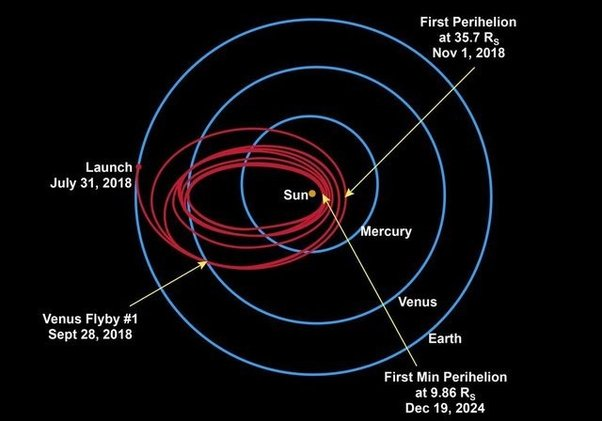

*Réponse publiée [sur Quora](https://fr.quora.com/Il-y-a-quelques-ann%C3%A9es-fut-lanc%C3%A9-le-Solar-Probe-pour-faire-un-coucou-au-soleil-jusqu-%C3%A0-4-millions-de-km-Selon-la-NASA-le-bouclier-pouvait-prot%C3%A9ger-la-sonde-jusqu-%C3%A0-1500-Que-sont-1500/answer/Dr-Goulu)*

On ne vous fait rien croire, un cours de physique n'est pas une messe ou un culte.

La surface du Soleil est à 5520°C environ (Le spectre du [Rayonnement solaire](w:)le prouve ).

C'est la température d'équilibre d'une boule de cette taille (de n'importe quelle matière) qui serait chauffée de l'intérieur par une puissance de 3,845 × 10^26 W et qui rayonnerait dans l'espace (ça, ça se calcule facilement si vous avez un niveau bac en maths, voir [Structure stellaire](w:) )

C'est la[fusion nucléaire](w:) au cœur du Soleil qui fournit cette puissance, à des millions de degrés (ça c'était un mystère jusque dans les années 1920 où c'est devenu une hypothèse, très vraisemblable depuis les années 1930, puis une certitude avec la détection des [neutrinos solaires](w:Neutrino_solaire) en 1968)

La [sonde spatiale Parker](w:Parker_(sonde_spatiale)), c'est son nom, a un bouclier thermique qui chauffera jusque vers 1400°C pendant les quelques heures où elle passera à environ 10 [rayons solaires](w:Rayon_solaire), soit 7 millions de km, pas 4. Ensuite elle s'éloigne beaucoup plus, parce qu'elle est sur une orbite très allongée, ce qui lui permet de refroidir avant le prochain passage (là c'est le job des ingénieurs de savoir calculer et concevoir ça)

Je vous ai mis (entre parenthèse) tout ce qui distingue la physique d'une religion. Il n'y a rien à croire, ni dogme, ni révélation, vous pouvez tout vérifier vous même.
