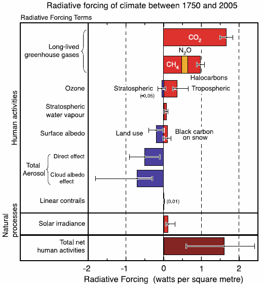

*Réponse publiée [sur Quora](https://fr.quora.com/Pourquoi-les-climato-septiques-utilisent-ils-l-optimum-climatique-m%C3%A9di%C3%A9val-comme-argument-pour-justifier-que-le-r%C3%A9chauffement-climatique-n-est-pas-d-origine-entropique-Quelles-sont-les/answer/Dr-Goulu)*

Ne posez pas deux questions en une svp.

Vous avez déjà posé la première des deux questions ailleurs et je vous ai déjà répondu

[Pourquoi les climato-septiques utilisent-ils l'optimum climatique médiéval comme argument pour justifier que le réchauffement climatique n'est pas d'origine entropique ? Quelles sont les causes de ce réchauffement ?](https://fr.quora.com/Pourquoi-les-climato-septiques-utilisent-ils-loptimum-climatique-m%C3%A9di%C3%A9val-comme-argument-pour-justifier-que-le-r%C3%A9chauffement-climatique-nest-pas-dorigine-entropique-Quelles-sont-les-causes-de-ce)

Mais je n'avais pas remarqué "climato-septiques" comme la fosse, alors bravo c'est très bien vu .

Les climatologues du monde entier ont commencé par chercher toutes les causes possibles au réchauffement actuel, on a lancé des satellites exprès pour mesurer le rayonnement solaire en plus des nombreux moyens indirects qu'on a sur Terre pour retrouver les valeurs historiques, et tous les résultats de toutes les études (sérieuses) ont été collectées par le GIEC et synthétisées dans des rapports périodiques qui montraient déjà en 2004 qu'il y a pas photo:

le réchauffement actuel ne peut être expliqué QUE par notre dégagement de gaz a effets de serre.

la variation du rayonnement solaire représente au maximum 10% du réchauffement constaté

Les climato-sCeptiques n'ont jamais pu expliquer d'où venait le Petawatt (2W / m2 multipliés par la surface de la Terre) manquant.
