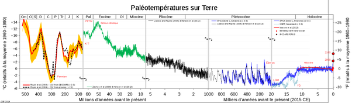

*Réponse publiée [sur Quora](https://fr.quora.com/Comment-le-climat-at-il-%C3%A9volu%C3%A9-au-cours-des-temps-g%C3%A9ologiques/answer/Dr-Goulu)*

Beaucoup plus lentement.

(source [Histoire du climat avant 1850 — Wikipédia](w:Histoire_du_climat_avant_1850) )

Attention, l'échelle du temps est logarithmique : la zone bleue couvre le dernier million d'années, on y distingue une succession de glaciations, mais les pentes de réchauffement correspondent à des milliers d'années, comme on le voit à la fin de la dernière, entre 20 et 10 mille ans.

Le réchauffement actuel de l'ordre de 2° par siècle n'a JAMAIS eu d'équivalent en terme de vitesse.

Le température actuelle est celle qu'on avait bien avant ça, au Pliocène il y a 5 à 10 millions d'années, quand il y avait d'ailleurs aussi 400ppm de CO2 comme maintenant.
