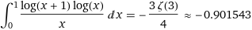

*Réponse publiée [sur Quora](https://fr.quora.com/Comment-calculer-l-integrale-de-la-fonction-1-x-ln-x1-lnx-dans-01/answer/Dr-Goulu)*

avec [Wolfram|Alpha](https://www.wolframalpha.com/input?i=integral+1/x*ln(x+1)*ln(x)+between+0+and+1)

$\zeta$est la [Fonction zêta de Riemann](w:)
