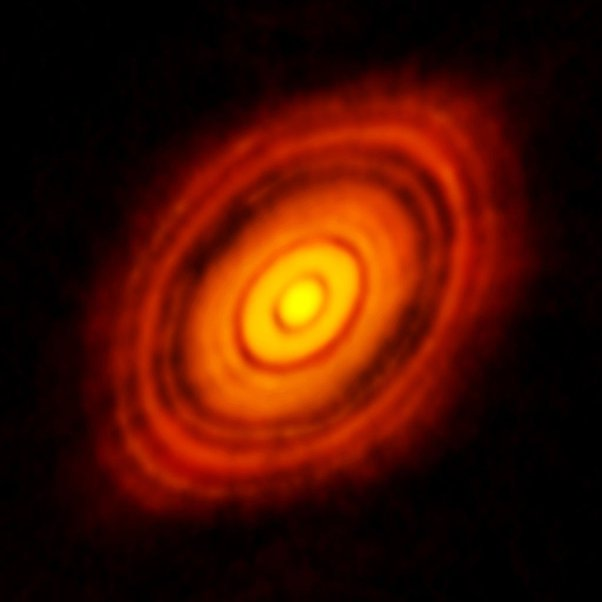
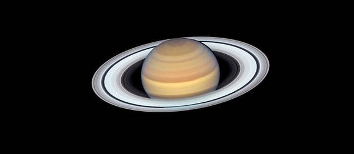

*Réponse publiée [sur Quora](https://fr.quora.com/Pourquoi-la-plupart-des-orbites-des-plan%C3%A8tes-de-notre-syst%C3%A8me-solaire-se-trouvent-elles-relativement-dans-le-m%C3%AAme-plan-en-2D/answer/Dr-Goulu)*

un nuage de gaz qui s'effondre forme un disque car

1. il conserve son moment cinétique, donc un axe de rotation
2. les forces de Coriolis rapprochent les particules éloignées du plan perpendiculaire à cet axe passant par le centre de gravité
3. les chocs des particules qui s'accumulent près de ce plan annule la composante vitesse perpendiculaire au plan

En quelques centaines de milliers d'années seulement, vous obtenez ça:

C'est le [Disque protoplanétaire](w:)de [HL Tauri](w:), à 450 années lumière. L'étoile s'est allumée il y a environ 100'000 ans seulement. Les cercles noirs sont des orbites "nettoyées" par des planètes en formation.

Autre exemple du même phénomène :

Les [Anneaux de Saturne](w:)ne font que quelques mètres d'épaisseur.
