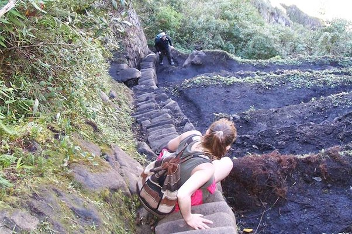

*Réponse publiée [sur Quora](https://fr.quora.com/Les-escaliers-de-la-mort-au-Machu-Picchu-sont-ils-vraiment-aussi-raides-qu-ils-sont-d%C3%A9crits-dans-les-illustrations-des-r%C3%A9seaux-sociaux/answer/Dr-Goulu)*

C'est raide, impressionnant pour ceux qui n'ont pas trop l'habitude de la montagne, mais pas vraiment plus raides que des escaliers normaux.

Les photos sont souvent trompeuses, mais regardez bien : à côté il y a des terrasses où on peut cultiver des patates…

Pour monter il faut juste un bon physique, c'est plutôt à la descente qu'on a peur de rater une marche, mais personne n'est jamais mort là.

[https://www.billetmachupicchu.co...](https://www.billetmachupicchu.com/verite-dangers-montagne-huayna-picchu/)
