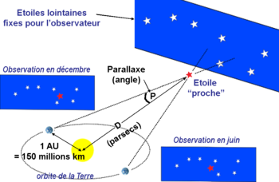

*Réponse publiée [sur Quora](https://fr.quora.com/Peut-on-estimer-%C3%A0-combien-de-distance-se-trouve-une-%C3%A9toile-uniquement-en-la-regardant/answer/Dr-Goulu)*

En plus des méthodes modernes mentionnées par [Drummer](https://fr.quora.com/profile/Drummer-1) , il y en a une plus ancienne qui marche presque à l'oeil, mais il faut regarder longtemps.

C'est la [Mesure de distance par la parallaxe annuelle](w:Parallaxe) : on mesure la direction de visée d'une étoile supposée proche par rapport à d'autres plus lointaines à 6 mois d'intervalle.

[Friedrich Wilhelm Bessel](w:)fut le premier à mesurer la distance d'une étoile ( [61 Cygni](w:)) en 1838, en utilisant cette méthode.

Aujourd'hui on connaît la distance des quelques 8000 étoiles les plus proches par cette méthode.

[https://fr.wikipedia.org/wiki/Me...](w:Mesure_des_distances_en_astronomie)
