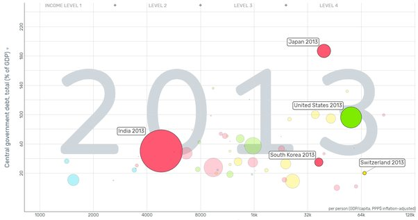
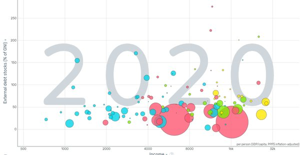

*Réponse publiée [sur Quora](https://fr.quora.com/Pourquoi-les-pays-les-plus-riches-sont-aussi-les-plus-endett%C3%A9s/answer/Dr-Goulu)*

Ca dépend ce que vous appelez "riches" et "dette".

Si on regarde la dette publique en proportion du PIB par rapport au PIB par habitant dans [Gapminder](https://www.gapminder.org/tools/#$ui$chart$cursorMode=plus;;&model$markers$bubble$encoding$y$data$concept=gc_dod_totl_gd_zs&source=wdi&space@=country&=time;;&scale$domain:null&zoomed@:0.02&:203.01;&type:null;;&x$scale$zoomed@:1262.06&:106381.72;;;&frame$value=2011;;;;;&chart-type=bubbles&url=v1),

on voit qu'en effet certains pays riches sont fortement endettés, mais ce n'est pas le cas de tous:

(il manque beaucoup de données, dont la France (…) j'ai choisi 2013 parce que c'est une année où il y a beaucoup de points.

C'est encore moins clair si on [représente la dette extérieure](https://www.gapminder.org/tools/#$model$markers$bubble$encoding$y$data$concept=dt_dod_dect_gn_zs&space@=country&=time;&source=wdi;&scale$domain:null&zoomed@:0&:260.96;&type:null;;&x$scale$zoomed@:609.2&:37571.63;;;&frame$value=2020;;;;;&chart-type=bubbles&url=v1), donc détenue en dehors du pays :

Là il manque carrément tous les pays "riches", ou disons plus riches que la Russie et le Turquie (les deux gros points jaunes en bas à droite, que l'on retrouve aussi dans le graphique du dessus.

Ca signifie que dans les pays riches, ce sont les citoyens (et entreprises) de ces mêmes pays qui prêtent à leur propre état !

Si l'Etat bouclait son budget avec des hausses d'impôts, ça mécontenterait les riches qui risqueraient de se tirer dans le pays voisin.

Alors que si l'Etat leur emprunte de l'argent, ils sont contents : ça fait un placement parmi les plus surs, souvent partiellement déductible de leur fortune.

Et l'Etat est content aussi parce que les intérêts qu'il paie restent dans le pays, donc rapportent des impôts, TVA et autres taxes…. Le taux réel d'intérêt est donc divisé par environ 2, ce qui le fait souvent passer en dessous de l'inflation : le prêteur est d'accord de perdre de l'argent, si c'est sur et moins cher que les impôts … Le top a été atteint en Suisse lorsque la Confédération a émis des emprunts à taux négatifs, qui lui ont permis de rembourser des emprunts à taux positif !

Le problème des pays pauvres (les pays africains sont en bleu dans les graphiques…) c'est qu'ils doivent emprunter (en dollars…) auprès d'étrangers qui ne bénéficient pas de ces avantages fiscaux. Et comme ces pays ne seront pas forcément capables de rembourser, il y a un risque qui se traduit par des intérêts plus élevés.

En résumé : on ne prête qu'aux riches …
