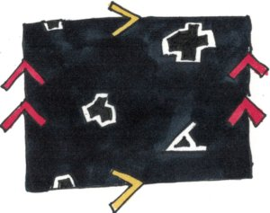
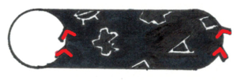
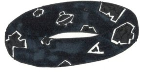

*Réponse publiée [sur Quora](https://fr.quora.com/Quelle-est-l-%C3%A9paisseur-de-l-univers-Puisqu-on-aurait-tendance-%C3%A0-penser-qu-il-est-plat-mais-malgr%C3%A9-tout-en-3-dimensions-voir-m%C3%AAme-4-car-on-peut-quitter-la-terre-dans-toutes-les-directions/answer/Dr-Goulu)*

Comme d'autres vous l'ont répondu, "plat" signifie que la [Courbure spatiale](w:)est nulle, ou presque, on est pas encore surs.

Mathématiquement, cette notion de courbure s'applique en N dimensions, et, plus étrange encore, ne nécessite pas une N+1ème dimension. Exemple : le jeu Asteroïds de ma jeunesse :

[https://www.youtube.com/watch?v=...](https://www.youtube.com/watch?v=WYSupJ5r2zo)

A première vue, ce jeu est "plat" en 2D, sur un écran.

Mais en y regardant de plus près, le vaisseau du joueur et les astéroïdes qui sortent de l'écran à droite réapparaissent à gauche (et vice-versa) et ceux qui ressortent par le bas réapparaissent en haut (et vice-versa)

Pour un ET vivant dans ce monde en 2D, les bords de l'écran seraient invisibles, mais si il s'apercevait qu'en allant toujours dans la même direction il revenait à son point de départ, il se dirait que son univers ne peut être que courbe.

Quel forme aurait-il ? Cassez-vous un peu la tête avant de lire la suite …

Quelle forme obtient-on si on raccorde par le haut et le bas d'une feuille de caoutchouc, puis le côté droit au côté gauche ? Non ce n'est pas une sphère …

C'est un tore ! [[1]](#cZfcl)

C'est pas intuitif, n'est-ce pas ? C'est juste pour prouver que ça n'aide pas forcément d'avoir une dimension de plus qu'un univers pour voir sa forme…

Et si nous vivions dans une version 3D du jeu Asteroids ? Disons qu'un ET serait en train de simuler notre univers sur son ordinateur quantique dans un cube, disons de 1000 milliards d'années-lumière de côté, avec la même règle qu'asteroïds : chaque face du cube est raccordée, ou plutôt identique à la face opposée. Vous arrivez à imaginer la forme que ça donne en 4D ?

Les matheux le peuvent : c'est un hypertore ou [3-torus - Wikipedia](w:en:3-torus) .

Homer Simpson demande d'ailleurs à Stephen Hawking ce qu'il pense d'un univers en forme de donut dans l'épisode "Les Gros Q.I." (S10E22) et Stephen Hawking trouve l'idée très intéressante, oubliant pour l'occasion que ce sont deux potes à lui Alexeï Starobinski et Yakov Zeldovich qui ont émis cette proposition en 1984.

Aujourd'hui les mesures du fonds diffus cosmologiques montrent que l'Univers n'est probablement pas un 3-tore[[2]](#pIziB).

Il y a plusieurs autres [Formes de l'Univers](w:Forme_de_l'Univers)possibles, mais les mesures actuelles montrent qu'il est peu courbé, donc très grand, voire infini.

Si l'univers est rigoureusement "plat", ça signifie que vous pouvez aller indéfiniment dans n'importe quelle direction, même à vitesse infinie, vous ne reviendrez jamais à votre point de départ.

Il y a d'autres possibilités que l'univers soit infini tout en n'étant pas plat, mais ça suffit pour ce soir …

Notes de bas de page

[[1]](#cite-cZfcl)[Asteroids on a Donut](https://infinityplusonemath.wordpress.com/2017/02/18/asteroids-on-a-donut/)

[[2]](#cite-pIziB)[Why The Universe Probably Isn’t Shaped Like A Donut](https://www.forbes.com/sites/startswithabang/2021/07/21/why-the-universe-probably-isnt-shaped-like-a-donut/?sh=5db1a3be6e60)
