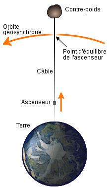

*Réponse publiée [sur Quora](https://fr.quora.com/Que-se-passe-t-il-si-j-accroche-une-corde-incassable-%C3%A0-un-objet-qui-orbite-autour-de-la-terre-%C3%A0-la-m%C3%AAme-vitesse-que-la-rotation-de-la-terre-Pourrait-on-relier-la-terre-et-l-objet/answer/Dr-Goulu)*

Un objet qui orbite autour de la terre à la même vitesse que la rotation de la terre s'appelle un [Satellite géostationnaire](w:)*, à 36'000 km au dessus du sol, et il n'a pas besoin de corde !

Si vous attachez un satellite géostationnaire avec votre corde, le poids de cette corde va tirer le satellite vers la Terre, et en changeant d'orbite il va avoir une vitesse angulaire plus élevée, et va donc tourner plus vite que la Terre et il va enrouler 36'000 km de corde autour de la Terre, donc presque un tour, vers l'est, donc il s'écrasera à 4000 km à l'ouest du point où vous avez attaché votre corde.

Si vous attachez un objet plus lointain avec une corde très longue, il n'orbite pas assez vite et va donc se décaler vers l'Ouest, enrouler la corde de plus d'un tour autour de la Terre, environ 10 tours s'il est au niveau de l'orbite lunaire par exemple.

Le seul moyen pour que votre combine marche, c'est que le centre de gravité de votre corde + de l'objet attaché se trouve pile-poil sur l'orbite géostationnaire.

C'est l'idée de l'[Ascenseur spatial](w:), qui implique donc une "corde" de plus de 36'000 km de long attachée à un contre-poids d'une masse très importante situé plus loin que l'orbite géostationnaire.

Note* : en fait l'orbite géostationnaire est un cas particulier d'[Orbite géosynchrone](w:), mais dans ce cas le satellite oscille au dessus de l'équateur
