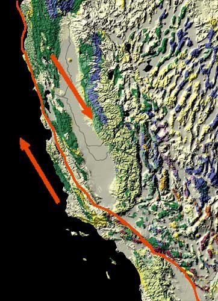

*Réponse publiée [sur Quora](https://fr.quora.com/Quand-la-faille-de-San-Andreas-va-t-elle-s-ouvrir/answer/Dr-Goulu)*

Rien ne dit qu'elle va s'ouvrir.

Les deux plaques coulissent l'une par rapport à l'autre de 4cm par an environ, ça suffit pour créer de nombreux tremblements de terre, dont certains très violents.

