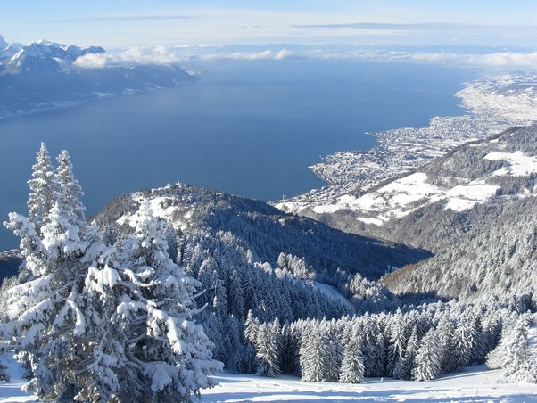

*Réponse publiée [sur Quora](https://fr.quora.com/Quel-est-votre-meilleur-souvenir-au-ski/answer/Dr-Goulu)*

Un jour de semaine. Il avait neigé la veille et toute la nuit, mais le soleil se levait sur une journée splendide.

Les transports pour aller au boulot (le labo où je planchais sur l'on doctorat) étaient bloqués, mais pas le petit train qui montait au [Rochers de Naye](w:)en passant par une [halte](w:Gare_de_Montreux-Les_Planches) à 50m de chez moi…

Je téléphone au boulot pour prendre congé et je prends le premier train, désert. Une heure plus tard, je fais LA trace de ma vie, dans une poudreuse vierge, avec une vue qui ressemble à ça :

