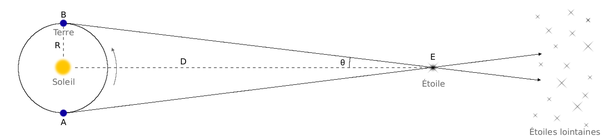

*Réponse publiée [sur Quora](https://fr.quora.com/Qu-est-ce-que-la-parallaxe-stellaire/answer/Dr-Goulu)*

> La **parallaxe annuelle**, **parallaxe héliocentrique** ou **parallaxe stellaire** d’une étoile est l’angle sous lequel on verrait, depuis cette étoile (E), le demi-grand axe de l’[orbite de la Terre](w:) (R).
>
>
>
> 
>
>
>
> ([Parallaxe — Wikipédia](w:Parallaxe))
