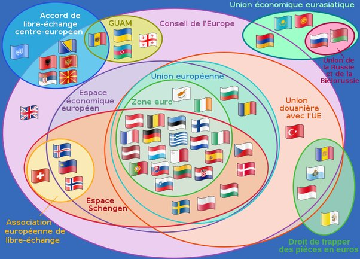

*Réponse publiée [sur Quora](https://fr.quora.com/Pourquoi-la-Suise-ne-fait-pas-partie-de-l-UE/answer/Dr-Goulu)*

il y a 3 S à Suisse.

Bof, quand on voit la pagaille que c'est, on hésite un peu …

on a une monnaie
