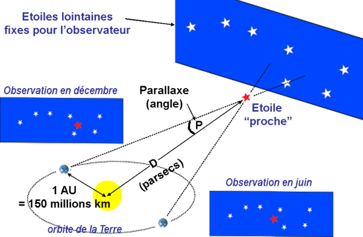
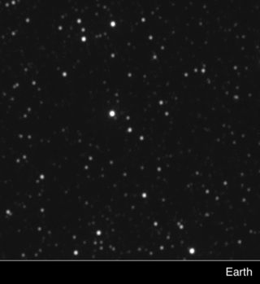

*Réponse publiée [sur Quora](https://fr.quora.com/L-%C3%A9toile-la-plus-proche-de-la-terre-est-situ%C3%A9-%C3%A0-422-a-l-comment-calculer-sa-distance-de-la-terre/answer/Dr-Goulu)*

Comme [Proxima Centauri — Wikipédia](w:Proxima_Centauri)

est toute proche, elle a une forte [Parallaxe](w:) : 768,5 ± 0,2 milli seconde d'arc.

On calcule la hauteur du triangle qui a une base d'une unité astronomique et un angle au sommet égal à la parallaxe et voilà.

En 2020 la sonde New Horizons a pris des images de Proxima du Centaure et en les comparant avec celles prises depuis la Terre on obtient ça :

[New Horizons Conducts the First Interstellar Parallax Experiment](https://www.nasa.gov/feature/nasa-s-new-horizons-conducts-the-first-interstellar-parallax-experiment)
