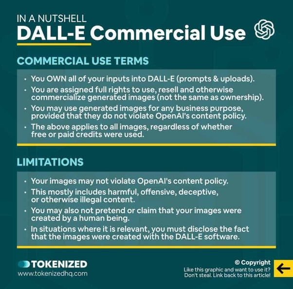

*Réponse publiée [sur Quora](https://fr.quora.com/Est-ce-que-les-images-g%C3%A9n%C3%A9r%C3%A9es-par-DALL-E-sont-prot%C3%A9g%C3%A9es/answer/Dr-Goulu)*

Non, OpenAI vous cède le droit de les utiliser sans restriction, mais elles ne sont pas votre propriété ni soumises à droits d'auteur puisque ce ne sont pas des "œuvres de l'esprit".

Par contre vous devez avoir un droit d'auteur ou une licence pour les images que vous fournissez à Dall-e, ou elles doivent être libres de droits, sans quoi le détenteur des droits pourrait vous attaquer en justice.

