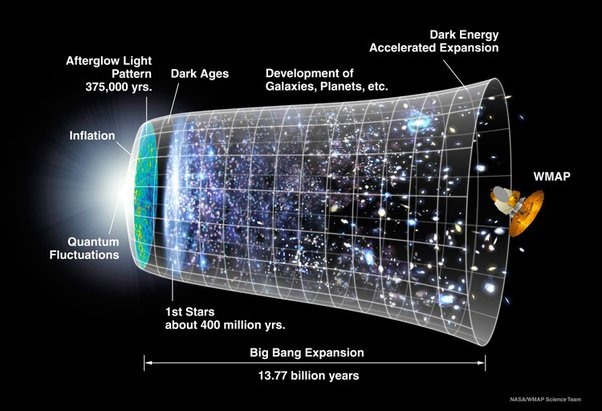
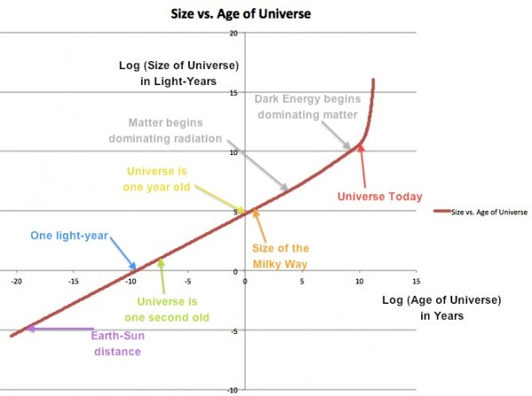

*Réponse publiée [sur Quora](https://fr.quora.com/Si-lespace-temps-est-en-expansion-quel-est-le-param%C3%A8tre-qui-quantifie-cette-expansion-Si-cest-le-temps-lui-m%C3%AAme-alors-nest-ce-pas-simplement-lespace-%C3%A0-3-dimensions-qui-est-en-expansion-Et/answer/Dr-Goulu)*

C'est l'espace qui est en [expansion](w:Expansion_de_l'Univers), pas l'espace-temps.

Le paramètre, c'est la [Constante de Hubble](w:)(qui n'est peut-être pas si constante que ça, mais c'est un autre problème).

La constante de Hubble donne le rapport moyen entre la [Vitesse de récession](w:)des galaxies et leur distance.

On a l'habitude de la donner en [kilomètres par seconde](w:Mètre_par_seconde) par [mégaparsec](w:Parsec) ($km/s/Mpc$ ou $km⋅s^{−1}⋅Mpc^{−1}$), mais en unités SI ça se ramène à des "$1/s$".

Donc effectivement, l'expansion ne dépend que du temps, donc on peut la représenter sur l'axe du temps comme ça :

( [Ouaip, c'est mon image de profil tellement elle est géniale](/2008/05/30/le-big-bang-en-une-image/). )

Ce qu'on voit là dessus ce sont des tranches (2D) de l'Univers observable au cours du temps, donc l' "espace-temps observable" c'est cette sorte de cloche, mais en 3D+1 chaque tranche est la sphère de l'Univers observable à ce moment là.

La forme de la cloche vient de ce que la constante de Hubble ne semble pas être constante.

D'une part, si on la mesure pour les galaxies "proches", donc pas très loin dans le temps, on trouve une valeur légèrement différente de la mesure pour des galaxies lointaines, ce qui a conduit à l'idée de l'[Accélération de l'expansion de l'Univers](w:).

D'autre part, tout au début d'autres considérations ont conduit à l'idée d'une [Inflation cosmique](w:)très rapide, donc avec une "constante de Hubble" énorme par rapport à maintenant.

Ce qui est marrant, c'est que si on reporte tout ça sur un graphique avec une échelle logarithmique du temps, tout devient beaucoup plus linéaire :

(source : [Ask Ethan #18: Why aren't we a black hole?](https://scienceblogs.com/startswithabang/2014/01/03/ask-ethan-18-why-arent-we-a-black-hole) qui explique pourquoi l'Univers n'est pas l'intérieur d'un trou noir au passage…)

Cette représentation accrédite l'idée qu'on ne mesure peut-être pas le temps dans les bonnes unités pour faire de la cosmologie. Les secondes ça a un sens avec une horloge atomique froide, mais quand l'Univers était si chaud et si plein de particules bizarres que les photons n'avaient même pas la place pour osciller, il faut peut-être utiliser une unité plus fondamentale…

Si la [Flèche du temps](w:)est déterminée par la thermodynamique, peut-être que l'inverse de la température ou l'entropie seraient des "unités de temps" plus indiquées.

[https://www.drgoulu.com/2008/06/...](/2008/06/06/la-grande-question-du-temps/)
