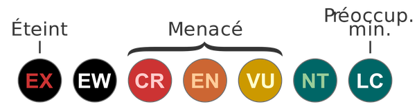

*Réponse publiée [sur Quora](https://fr.quora.com/Quelles-esp%C3%A8ces-animales-sont-menac%C3%A9es-d-extinction/answer/Dr-Goulu)*

Aucune des espèces mentionnées dans les autres réponses ne fait partie des 3877 espèces animales classées aujourd'hui en danger CRitique d'extinction selon le [Statut de conservation de l'UICN.](w:Statut_de_conservation)

Le [Grand requin blanc](w:)est classé VU-lnérabe, 2 catégories en dessous. Comme l'[Ours blanc](w:) et 5 autres espèces d'[Ursidae](w:).

L'ours brun et l'ours noir d'Amérique sont classés LC ("least concern", pas menacés) comme le [loup](w:Canis_lupus) .

Le [Jaguar](w:)est classé NT pour quasi menacé, entre LC et VU. Le [Guépard](w:)et le [Lion](w:)sont classés VU.

Le [Napoléon](w:Napoléon_(poisson))est classé EN danger, entre VU et CR, comme le [Gorille des montagnes](w:Gorilla_beringei_beringei) et le [Dauphin de l'Irrawaddy](w:), le [Tigre du Bengale](w:), le [Diable de Tasmanie](w:)ou nos cousins [Pan troglodytes](w:)et [Bonobo](w:).

Ok, le [Rhinocéros noir](w:)et le [Rhinocéros de Sumatra](w:)et celui [de Java](w:Rhinocéros_de_Java)sont classés CR, mais pas le [Rhinocéros indien](w:) (VU) et encore moins le [Rhinocéros blanc](w:)(NT), donc quand on parle juste de "[Rhinocéros](w:)" il faut être précis parce que mon petit doigt me dit que vous ne saviez même pas qu'il y a des rhinos en Asie...

Le problème des 3877 espèces animales en train de s'éteindre, c'est que vous n'en connaissez même pas 20. A part les scientifiques, personne n'écrit d'articles sur elles. On s'en fout.

[Réponse de Dr. Goulu à Quelles sont les espèces animales les plus menacées d'extinction ?](https://fr.quora.com/Quelles-sont-les-esp%C3%A8ces-animales-les-plus-menac%C3%A9es-dextinction/answer/Philippe-Guglielmetti)
