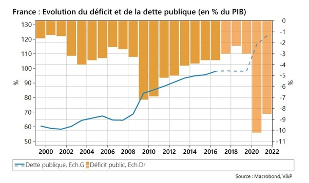

*Réponse publiée [sur Quora](https://fr.quora.com/Au-d%C3%A9part-de-Manu-quel-seras-le-d%C3%A9ficit-de-la-France-l%C3%A9gu%C3%A9-%C3%A0-nos-enfants/answer/Dr-Goulu)*

(Vu de Suisse… chuis neutre, tirez pas…),

A part pour financer vos vies quand l'économie était à l'arrêt pour cause de Covid, la dette a plutôt été stable depuis l'élection de "Manu" en 2017 , et le déficit avait plutôt été réduit.

Ensuite ce n'est pas le déficit de la France mais celui de l'Etat, et encore moins le votre : vous pouvez vous tirer dans un autre pays sans avoir à rembourser votre part de la dette. Le problème est "simplement" que les impôts et taxes ne couvrent pas le coût de tous les services que vous recevez de l'état. Vous ne payez pas assez cher pour ce que vous recevez.

Au niveau de la France, il se passe un truc intéressant :

1. la balance commerciale plonge : vous importez plus que vous n'exportez. Le monde veut moins de produits français, et vous voulez plus de produits de l'étranger.
2. la [Balance courante](w:)reste à peu près équilibrée. C'est elle qui mesure "les sous qui entrent - les sous qui sortent". La différence entre les deux, c'est le tourisme (vous voyez le gros trou du Covid…) et les investissements (les russes qui achètent des maisons sur la côte et les chinois qui achètent des entreprises françaises)

Donc "Manu" a plutôt fait du bon boulot depuis 2017 et va vous laisser un pays dans l'état où VOUS le laisserez : avec des entreprises qui produisent ou en grève, avec des touristes qui viennent voir votre magnifique pays ou avec des ordures dans les rues, à vous de voir ce que VOUS léguerez à vos enfants.

[https://www.lafinancepourtous.co...](https://www.lafinancepourtous.com/2022/06/27/faut-il-sinquieter-de-laugmentation-de-la-dette-publique-en-france/)
