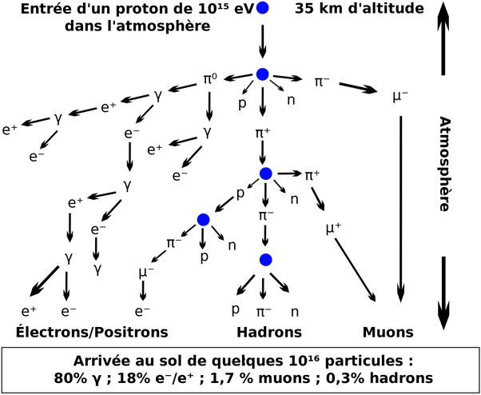
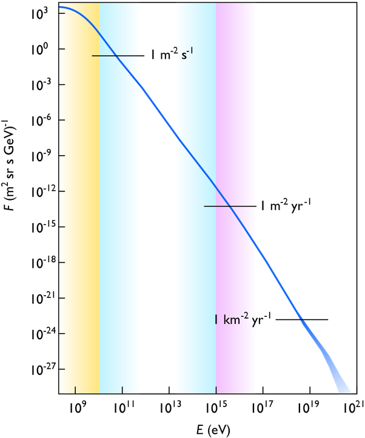

*Réponse publiée [sur Quora](https://fr.quora.com/Comment-l-atmosph%C3%A8re-nous-prot%C3%A8ge-t-elle-du-rayonnement-cosmique-que-les-astronautes-subissent/answer/Dr-Goulu)*

juste en interceptant les particules rapides. La collision avec les molécules d'azote ou d'oxygène produit une "cascade" de particules de moins en moins énergétiques jusqu'au sol, en ionisant les atomes touchés, ce qui produit les aurores boréales et de l'ozone notamment.

Exemple tiré de [Rayonnement cosmique — Wikipédia](w:Rayonnement_cosmique) :

Un millimètre d'aluminium arrête facilement les particules issues du soleil (le vent solaire) qui ont des énergies de quelques keV seulement (jaune sur la figure ci-dessous), des milliards de fois moins que le rayon cosmique ci-dessus (violet) qui n'arrive qu'une fois par mois et par m^2.

Alors combien de mm d'aluminium faut-il pour arrêter un rayon un milliard de fois plus énergétique ? des milliers de km ?

Perdu. En fait un blindage a une efficacité exponentielle : disons que 1mm réduit l'intensité du rayonnement d'un facteur 1000, de 1keV à 1eV. Alors un 2ème millimètre le réduit de 1000^2 = 1 million, le 3ème de un milliard, et avec 5mm de blindage (plutôt 1~cm d'après les articles que j'ai trouvés) le réduit de 10^15.

Bref, avec une coque de quelques cm, et encore mieux si vous avez des réservoirs d'eau entre la coque et vous, vous êtes peinard pour un vol interplanétaire de longue durée.

En fait, là où vous ramassez le plus de radiation, c'est à l'extérieur du vaisseau, sur la Lune ou sur Mars. Raison pour laquelle les bases sur les planètes seront souterraines ou ne seront pas.

En passant, l'électronique est plus sensible que nous aux radiations (les articles que j'ai trouvés correspondent au blindage pour l'électronique…) et on a des centaines de satellites qui marchent très bien dans l'espace depuis des décennies avec un blindage très raisonnable…
