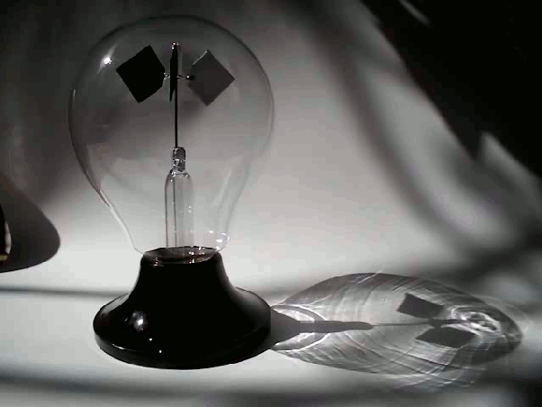

*Réponse publiée [sur Quora](https://fr.quora.com/Comment-peut-fonctionner-une-voile-solaire-sachant-que-les-photons-n-ont-pas-de-masse/answer/Dr-Goulu)*

ils ont une [impulsion (=quantité de mouvement)](w:Relation_de_Planck-Einstein) quand même.

La [Pression de rayonnement](w:) parvient à faire tourner un [Radiomètre de Crookes](w:)(dans le bon sens quand le vide est assez poussé…), alors pour une [Voile solaire](w:)on obtient 99.08 μN/m^2 au niveau de l'orbite terrestre. C'est pas énorme, mais ça peut pousser longtemps…

