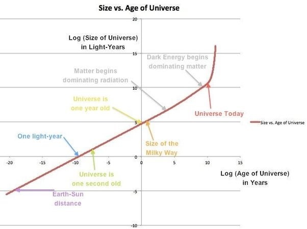

*Réponse publiée [sur Quora](https://fr.quora.com/Quelle-%C3%A9tait-la-taille-de-l-Univers-une-heure-apr%C3%A8s-le-Big-Bang-Quelle-serait-sa-taille-apr%C3%A8s-encore-14-milliards-d-ann%C3%A9es/answer/Dr-Goulu)*

Si l'univers est infini, il était déjà infini lors du Big Bang. On ne peut parler que de la taille de l[Univers observable](w:)

Celle ci est donnée dans le graphique ci dessous

Une heure après le BB, le rayon était d'une heure lumière, ce qui n'est pas étonnant puisque par définition l'[Horizon cosmologique](w:)de l Univers observable s'éloigne à c.

Ce qui peut paraître surprenant, c'est quand on dit qu'aujourd'hui, 13.7 miliiards d'années après, il est à 45 miliards d'années-lumière. C'est parce que l'univers a continué à s'étendre, environ dvun facteur 3, pendant les 13.7 milliards d'années.
