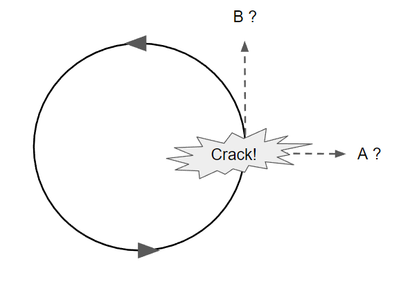

*Réponse publiée [sur Quora](https://fr.quora.com/Quelles-sont-les-diff%C3%A9rences-entre-les-forces-centrifuges-et-centrip%C3%A8tes-Pourquoi-une-des-2-forces-est-elle-en-vigueur-plut%C3%B4t-quune-autre-dans-un-ph%C3%A9nom%C3%A8ne-donn%C3%A9/answer/Dr-Goulu)*

La [Force centrifuge](w:)n'existe pas, c'est une "force virtuelle", une impression causée par l'inertie.

Quand vous êtes dans un manège comme celui ci-dessous, les forces auxquelles vous êtes exposé sont

1. votre poids, vertical vers le bas
2. la traction des chaînes qui vous tirent vers le haut (pour compenser le poids) et vers le centre, exerçant donc une [Force centripète](w:), qui existe, elle.

Alors pourquoi êtes-vous "éjecté vers l'extérieur" ?

Parce que votre [Inertie](w:)aimerait vous faire aller tout droit (première loi de Newton)

Pour voir si vous avez compris, les chaînes de votre balançoire cèdent. Où allez-vous vous écraser ? En A ou en B ?

Si vous pensez A, regardez quelques vidéos de sorties de route de voitures de rallye ou de cyclistes.

Quand l'adhérence sur la route diminue brutalement, il se passe la même chose que lorsque la balançoire cède : la force centripète disparaît, et la victime ne tourne plus : elle continue tout droit…

…et s'écrase en B.

Il n'y a donc aucune force qui vous tire vers l'extérieur. La seule force qui existe, c'est celle qui vous accélère vers l'intérieur, ce qui transforme votre vitesse "tout droit" en vitesse "tangente au cercle".

La force centrifuge est une illusion provenant du fait que vous n'êtes pas dans un [Référentiel galiléen](w:)lorsque vous tournez ainsi. Vous êtes accéléré vers le centre du cercle.
