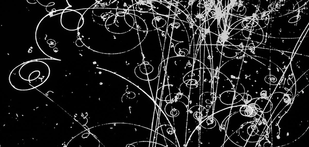

*Réponse publiée [sur Quora](https://fr.quora.com/Comment-les-d%C3%A9tecteurs-du-LHC-permetent-ils-de-trouver-la-trajectoire-des-particules/answer/Dr-Goulu)*

L'3nerhie des particules est telle qu'elles interagissent avec plusieurs atomes du détecteur avant d'être absorbées ou de se désintégrer en autres particules également détectées.

Dans les bonnes vieilles [Chambre à bulles](w:), les particules produisaient des spirales de bulles sur leur parcours, qu'on pouvait photographier

