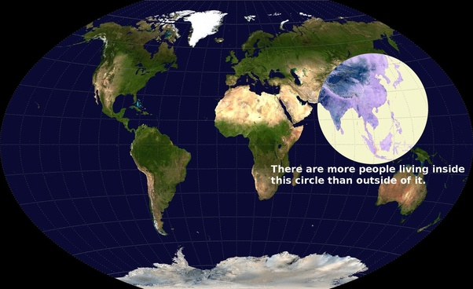

*Réponse publiée [sur Quora](https://fr.quora.com/Quel-est-le-continent-le-plus-peupl%C3%A9-selon-vous/answer/Dr-Goulu)*

Pourquoi "selon vous ?" à propos d'une question purement factuelle sur laquelle il n'y a aucune controverse ?

Selon moi , Ken Myers , auteur du "[Valeriepieris circle](w:en:Valeriepieris_circle)" a fait du bon boulot avec cette représentation percutante : la moitié de l'humanité vit dans ce cercle, l'autre moitié en dehors.

