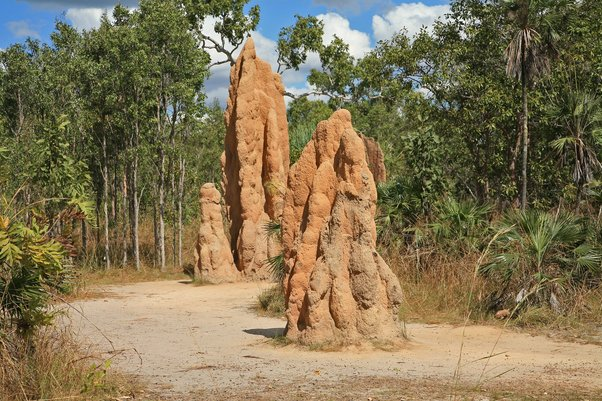

*Réponse publiée [sur Quora](https://fr.quora.com/Ai-je-bien-compris-en-sciences-comme-en-politique-la-terre-serait-une-oasis-dans-le-syst%C3%A8me-solaire-qui-irait-%C3%A0-la-vitesse-de-200-%C3%A0-250-km-seconde-dans-l-univers-et-que-l-homme-serait/answer/Dr-Goulu)*

Non, vous n'avez pas compris ce qu'est une vitesse, ni la seconde loi de la thermodynamique.

Les platanes, les termites et les cyanobactéries feraient exactement comme nous si elles pouvaient.

