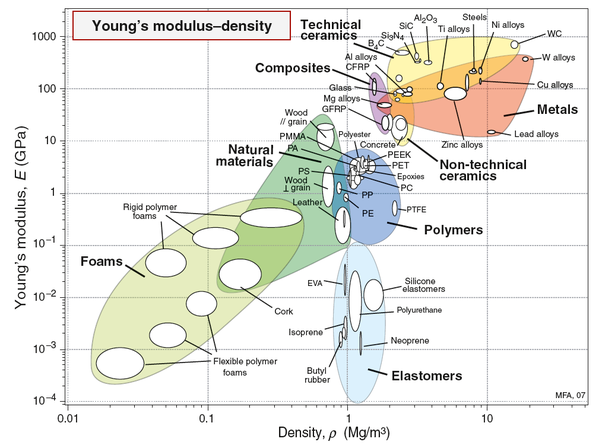

*Réponse publiée [sur Quora](https://fr.quora.com/Quelle-%C3%A9paisseur-devrait-faire-une-plaque-daluminium-pour-obtenir-la-m%C3%AAme-r%C3%A9sistance-m%C3%A9canique-quune-plaque-dacier-de-5mm-Comment-calcule-t-on-ce-genre-d%C3%A9quivalence-entre-les-mat%C3%A9riaux/answer/Dr-Goulu)*

Si votre plaque d'acier est en traction, alors elle aura d'abord une "déformation élastique" : comme un ressort, elle reviendra à sa dimension normale si vous relâchez la force.

Si vous voulez que la plaque d'alu ait la même rigidité, vous devez comparer les [Module de Young](w:)(ou d'élasticité) de l'acier et de l'aluminium. Ils valent respectivement 210 et 69 GPa (ça dépend un peu des types d'acier et des alliages d'alu) donc il vous faudra une section triple de la tôle, donc une épaisseur triple pour avoir la même rigidité en traction.

Mais si vous tirez trop fort, votre pièce d'acier ou d'alu ne va pas revenir à sa forme de base : la déformation sera permanente, "plastique". Ca arrive quand on atteint la [Limite d'élasticité](w:).

Cette limite varie beaucoup selon le matériau et le traitement (trempage, écrouissage etc) mais pour l'acier vous êtes autour de 300 MPa alors que pour l'alu c'est entre 90 et 470 MPa.

Vous pouvez donc trouver de l'alu "haute résistance" qui aura la même limite que l'acier pour la même épaisseur (mais se déformera donc 3x plus sous la même force à cause du Module de Young), mais avec de l'alu "standard" il faudra donc aussi une épaisseur triple pour correspondre à l'acier.

La rupture de la pièce est beaucoup plus difficile à prévoir, car ça dépend de la propagation de fissures dans le matériau, donc une petite rayure, des contraintes thermiques lors de la fabrication etc.

Dans certaines conditions, le matériel ne casse "jamais" : il s'étire comme un fil. C'est d'ailleurs comme ça qu'on produit les fils, les tubes et certains profilés, notamment en aluminium. En fait dans ce genre de cas, on arrive même pas à exercer une force beaucoup plus élevée que la limite élastique tellement le matériau se déforme en même temps.

En pratique, on considère que quand la pièce a dépassé la limite élastique elle est fichue.

Tout ça c'était pour la traction. C'est valable aussi pour la compression, mais jusqu'au moment ou votre tôle "[Flambe](w:Flambage)", ce qui arrive souvent avant la limite d'élasticité, et si vous continuez à appuyer vous atteignez cette limite et la tôle ne revient plus droite.

Si votre tôle est en [Flexion](w:Flexion_(matériau)), donc si vous voulez la plier, ce qui se passe c'est que la surface convexe se retrouve en traction et la surface concave en compression, le milieu de la tôle (la "fibre neutre") n'étant soumise à aucune force. Là on peut montrer que les contraintes vont être inversement proportionnelles au [Moment quadratique](w:)de la section de la poutre, donc au carré de l'épaisseur pour votre tôle.

Autrement dit, puisque l'alu est 3x plus élastique que l'acier, une tôle $\sqrt{3}$ fois plus épaisse en alu qu'en acier aura la même élasticité, donc une tôle alu de 8.7 mm se comportera en flexion comme une tôle de 5mm en acier.

On apprend tout ça et plein d'autres choses dans un cours de [Résistance des matériaux](w:), où on apprend aussi qu'il est très difficile de remplacer un matériau par un autre parce qu'en général il y a un prix à payer.

Dans votre exemple, l'acier est plus dense que l'alu, mais il faut plus d'alu pour la même rigidité, alors que faut-il utiliser dans un avion ?

Pour répondre à ce genre de questions, on utilise des diagrammes d'[Ashby](w:Michael_Ashby)qui positionnent les matériaux sur des paires de paramètres, par exemple Module de Young et densité dans celui-ci :

On voit que tous les matériaux sauf les élastomères se retrouvent plus ou moins sur une "droite" dans ce graphique, mais attention à l'échelle log/log ; un matériaux 100x plus résistant qu'un autre n'est que 10x plus dense.

On voit que les alliages d'aluminium et les aciers sont dans la petite zone orange, avec un facteur 3 entre eux tant pour la résistance que pour la densité, et qu'entre deux on a le Titane qui peut être intéressant aussi, et un peu à gauche les composites.

Dans un avion, on se retrouve donc avec tous ces matériaux à peu près "équivalents" en terme de résistance/poids en fonction d'autres critères (résistance à la température, à la fatigue, prix etc)
