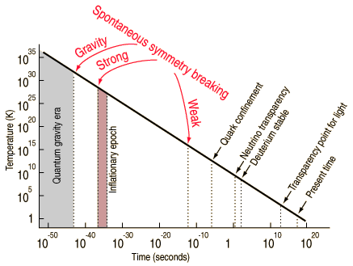

*Réponse publiée [sur Quora](https://fr.quora.com/Si-le-Big-Bang-%C3%A0-13-7-milliards-dann%C3%A9es-quavait-il-y-a-14-milliards-dann%C3%A9es-y-a-100-milliards-dann%C3%A9es/answer/Dr-Goulu)*

Si le zéro absolu est à -273.15°C, comment est un glaçon à -300 ou -2000 degrés ?

Cette question semblait pleine de sens avant qu'on comprenne ce qu'est la température.

Etes-vous sur que votre question est plus sensée ? Alors définissez le temps… Pas juste l'année, ou la seconde que mesure votre montre de la même manière qu'un thermomètre mesure la température, mais le phénomène physique qui fait que "le temps s'écoule" ?

Un thermomètre mesure très indirectement l'agitation des molécules, et un thermomètre courant ne fonctionne qu'au dessus du point de congélation du mercure , à -39°C. En dessous il faut d'autres appareils de mesure. Et pour mesurer des températures de microkelvins, voire de nanokelvins, il faut instruments très étranges comme le [Thermomètre à blocage de Coulomb](w:Blocage_de_Coulomb). Mais on peut au moins faire ça dans un labo.

Mais comment mesurer des microsecondes ou des nanosecondes après le Big Bang ?

La seconde est définie comme le temps nécessaire à 9192631770 [transitions hyperfines](w:Structure_hyperfine) de l'[atome](w:) de [césium](w:) 133 non perturbé.

Mais que valait-elle avant qu'il n'existe le moindre atome de césium ? Et quand l'univers était si chaud et dense que la lumière n'avait pas la place d'osciller une seule fois avant d'être absorbée par un électron ? Quand le chaos était tel qu'il n'y avait absolument aucun événement périodique, et encore moins de manière de le mesurer ?

On ne sait pas encore clairement ce qu'est le temps, mais la [Flèche du temps](w:) semble très liée à la température, ou à l'entropie : le temps s'écoule dans le sens du refroidissement de l'Univers.

C'est très clair quand on représente l'[Histoire et la chronologie de l'Univers](w:Histoire_et_chronologie_de_l'Univers) sur une échelle logarithmique :

Sur ce graphique, on voit que le lien entre temps et température est linéaire, et que si on mesure le temps en log (seconde), alors il s'est passé beaucoup plus de choses pendant la première seconde après le Big Bang qu'après.

Si on mesure le temps en log (secondes) ou en 1/température, alors on a de gros problèmes à décrire ce qu'il y avait avant le [Temps de Planck](w:), à la [Température de Planck](w:), mais rien ne dit qu'il n'y avait rien.

Ni même qu'il s'est passé quelque chose de spécial.

Le Big Bang est un nom donné (par dérision par quelqu'un qui n'y croyait pas) à un "zéro absolu" si on le mesure en secondes. Mais avec les "bonnes" unités, ce n'est pas un événement, il s'étale depuis -43 et peut-être depuis moins l' infini, comme l'agitation des molécules donne l'illusion d'une température limite.
