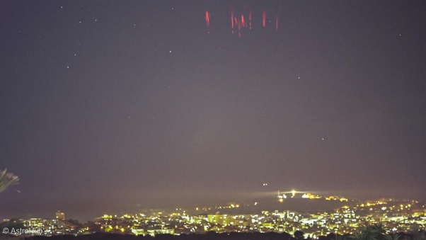
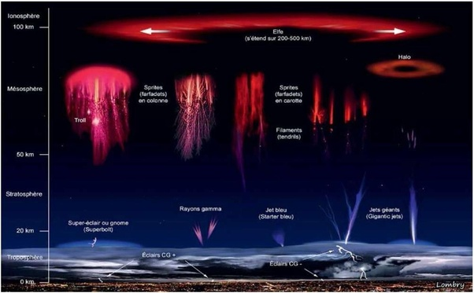

*Réponse publiée [sur Quora](https://fr.quora.com/Quelle-est-la-preuve-la-plus-convaincante-de-lexistence-des-OVNI-et-comment-peut-on-expliquer-les-observations-qui-ne-peuvent-pas-%C3%AAtre-attribu%C3%A9es-%C3%A0-des-ph%C3%A9nom%C3%A8nes-terrestres-connus/answer/Dr-Goulu)*

Vous croyez aux elfes, aux trolls et aux farfadets ?

Ben vous devriez. Ce sont des [Phénomène lumineux transitoire](w:)désormais bien visibles depuis les satellites et les ballons sonde dans la haute atmosphère, mais imaginez que vous vous baladez sur les hauteurs d'Antibes et que vous voyiez ça :

On ne pourrait pas vous en vouloir de croire aux OVNI : ça a l'air d'objets, ils on l'air de voler, et ils sont clairement Non Identifiés.

