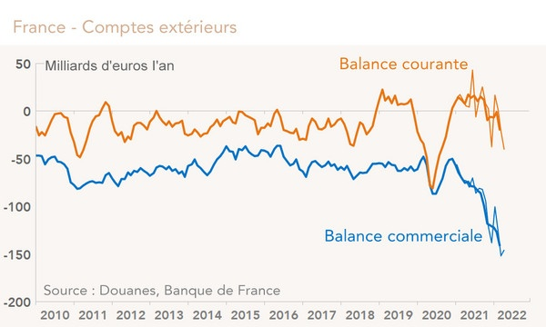

*Réponse publiée [sur Quora](https://fr.quora.com/Est-ce-quun-pays-dont-les-budgets-sont-globalement-en-d%C3%A9ficit-%C3%A9tat-s%C3%A9cu-retraite-collectivit%C3%A9s-peut-malgr%C3%A9-cela-r%C3%A9duire-sa-dette-publique-Si-oui-comment/answer/Dr-Goulu)*

Vous confondez pays et état.

Les déficits et dette que vous mentionnez sont ceux de l'état, pas du pays.

De même que vous pouvez avoir un budget sain et travailler dans une entreprise en déficit, le déficit et les dettes de votre employeur ou de votre pays ne sont pas les vôtres : vous pouvez partir sans les payer.

Un état peut tout à fait réduire sa dette publique en réduisant ses dépenses et/ou en percevant plus d'impôts.

Pour cette seconde éventualité, il faut que les entreprises et ménages privés acceptent la hausse d'impôts sans se barrer les payer ailleurs (parfois pas loin…)

Pour ça il faut que leur propre budget soit assez sain, et c'est là qu'il faut considérer le budget du pays entier, qui se mesure par la [Balance courante](w:).

En France elle est à peu près stable depuis 2018, à part un gros trou du au Covid-19, malgré une chute récente de la balance commerciale qui ne mesure que les exportations-importations :

La différence entre les deux, c'est principalement le tourisme (d'où un plus gros trou dans la balance courante que dans la commerciale)

Donc en gardant la France attractive, sans poubelles dans les rues et grèves qui chassent les touristes, la France a encore une petite chance d'éviter les [Déficits jumeaux](w:).

Parce que si vous avez à la fois un état qui ne tourne pas et des habitants qui perdent du fric, là vous êtes mal.

Là le seul moyen de s'en sortir est de faire marcher la planche à billets, en encore, à condition d'avoir une monnaie forte. C'est ce qu'on fait les USA, mais pour un pays de la zone Euro, faut convaincre les autres …
