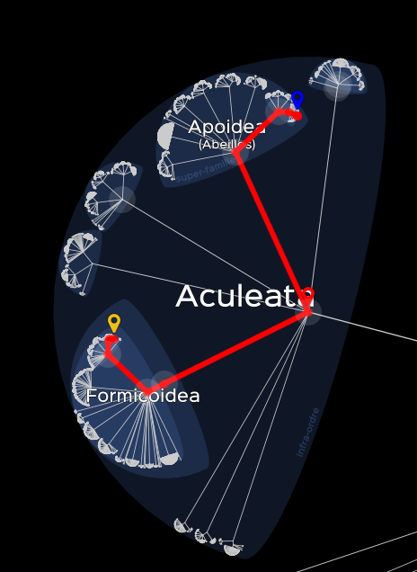

*Réponse publiée [sur Quora](https://fr.quora.com/Les-insectes-fourmi-formes-sont-ils-tous-de-la-m%C3%AAme-branche-dans-la-classification-explication-de-la-question-en-commentaire-si-besoin/answer/Dr-Goulu)*

D'après le commentaire, je vois deux aspects à la question:

- La relation évolutive entre les fourmis et d'autres animaux, par exemple les abeilles. Vous pouvez la trouver facilement dans le génial [Lifemap](https://lifemap-fr.univ-lyon1.fr/) qui contient l'arbre généalogique de toutes les espèces connues.

En l’occurrence, l'ancêtre commun des abeilles et des fourmis était un [Aculeata](w:), et effectivement ils se distinguent par l'existence d'un dard, donc oui, c'est le résultat de spéciations d'un ancêtre commun

- mais d'autres caractéristiques similaires entre espèces distinctes peuvent être le résultat d'une [Convergence évolutive](w:), comme la forme des poissons et des cétacés, mais l'exemple que je trouve le plus spectaculaire (et reliés aux abeilles et fourmis) est le vol, que les insectes, les oiseaux et les chauve-souris ont développé indépendamment, sans parler des poissons volants, des écureuils volants et même des [serpents volants](w:Chrysopelea) qui sont en train de le faire.
